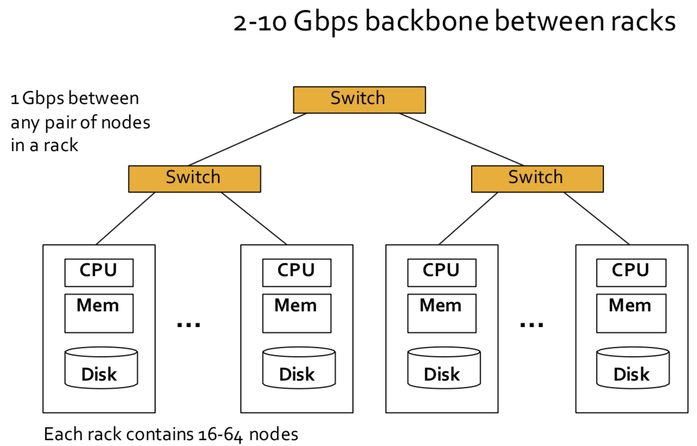
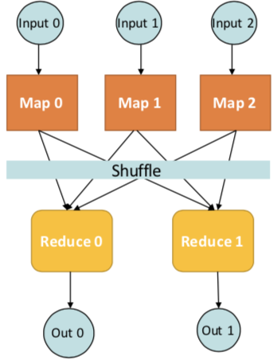
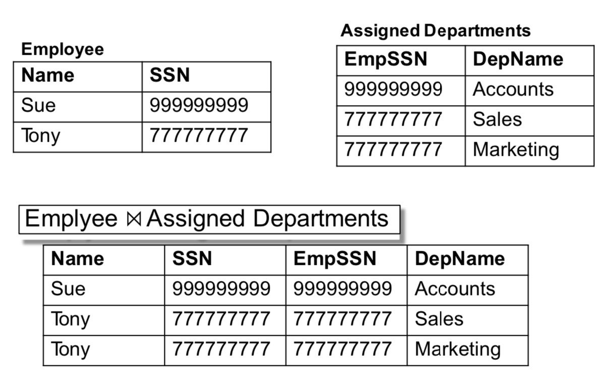
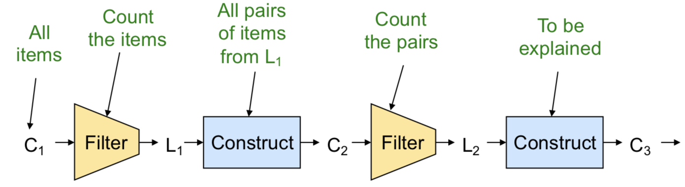

# niINF-553 Foundations and Applications of Data Mining 2019 Fall
by Dr. Anna Farzindar  

[TOC]

## Week1 - Part 1: Introduction

__What this course is about?__ $Data$ $mining$: extraction of <u>actionable information</u> from (usually) very large datasets, is the subject of extreme hype, fear, and interest.


__Modeling:__ a model is a simple presentation of the data, typically used for prediction. Like $PageRank$.


__Rules vs Models:__ in many applications, we only want to know "yes" or "no". Like email spam.


__Outline of Course:__

- Map-Reduce and Hadoop
- Frequent itemsets, the Market-Basket Model and Association rules
- Finding similar sets
  - Minhashing, Locality-Sensitive hashing
- Recommendation systems
  - Collaborative filtering
- Clustering data
- PageRank and related measures of importance on the Web (link analysis)
  - Spam detection
  - Topic-specific search
- Extracting structured data (relations) from the Web
- Managing Web advertisements
- Mining data streams


__Knowledge discovery from data.__

Extracting the knowledge data needs to be:

- stored
- managed
- analyzed

__Data Ming__$\approx$__Big Data__$\approx$__Predictive Analytics__$\approx$__Data Science__


__What is data mining?__

- Given lots of data
- Discover patterns and models that are:
  - Valid: hold on new data woth some certainty
  - Useful: should be possible to act on the item
  - Unexpected: non-obvious to the system
  - Understandable: humans should be able to interpret the pattern


__Data Mining Tasks:__

1. Descriptive methods
   - Find human-interpretable patterns that describe the data
   - Example: clustering
2. Predictive methods
   - Use some variables to predict unknown or future values of other variables
   - Example: Recommender systems


__Meaningfulness of Analytic Answers:__

- A **risk** with “Data mining” is that an analyst can “discover ”  patterns that are **meaningless**
- Statisticians call it **Bonferroni’s principle**:
  - if you look in **more places** for interesting patterns than your amount of data will support, **you are bound to find crap.**
  - Example: 
    - Total information awareness
    - Using predictive policing

<u>When looking for a property (e.g., “two people stayed at the same hotel twice”), make sure that the property does not allow so many possibilities that random data will surely produce facts “of interest.</u>


## Week1 - Part 2: Large-Scale File Systems and Map-Reduce

**MapReduce:**

- Google’s computational/data manipulation model
- Elegant way to work with big data


Recently standard architecture for large-data emerged:

- Cluster of commodity Linux nodes
- Commodity network (ethernet) to connect them


__Cluster computation:__



__Large-scale Computing:__

- Large-scale computing for data mining problems on commodity hardware


__Cluster Computing Challenges:__

- Machines fail
- Network bottleneck:
  - Network bandwidth= 1 Gbps
  - Moving 10TB takes approximately 1 day
- Distributed programming is hard!
  - Need a simple model that hides most of the complexity


### Map-Reduce

Map-Reduce addresses the challenges of cluster computing:

- <u>Store data redundantly</u> on multiple nodes for persistence and availability
- <u>Move computation</u> close to minimize data movement
- <u>Simple programming model</u> to hide the complexity of all this magic


__Issue:__ Copying data over a network takes time

__Idea:__

- Bring computation to data
- Store files multiple times for reliability

__MapReduce addresses these problems:__

- Storage infrastructure - file system (distributed file system)
  - Google: GFS
  - Hadoop: HDFS
- Programming model:
  - MapReduce

#### Storage infrastructure

**Typical usage pattern for distributed file system:**

- Huge files
- Data are rarely updated in place
- Reads and appends are common


__Distributed File System:__

- <u>Chunk servers:</u>
  - File is split into contiguous ***chunks***
  - Typically each chunk is 64MB
  - Each chunk replicated (usually 2x to 3x)
  - Try to keep replicas in **different racks**
- <u>Master Node:</u>
  - also known as __Name Node__ in Hadoop's HDFS
  - Stores __metadata__ about where files are stored
  - Master node might be __replicated__
- <u>Client library for file access:</u>
  - Talks to master to find chunk servers
  - Connects directly to chunk servers to access data


<u>Chunk servers also serve as compute servers.</u>

<u>Bring computation directly to the data.</u>


#### Map Reduce: Overview

3 steps of MapReduce:

- <u>Map:</u> Extract something you care about (keys)
- <u>Group by key:</u> Sort and shuffle
- <u>Reduce:</u> Aggregate, summarize, filter or transform
- Output the result


- __Input:__ a set of key-value pairs
- __Programmer specifies two methods:__
  - Map(k,v) $\to$ <k', v'>*
    - Takes a key-value pair and outputs a set of key-value pairs
    - There is one Map call for every (k,v) input pair
  - Reduce(k', <v'>*) $\to$ <k', v''>*
    - Takes a key-value group as input, outputs key-value pairs
    - All values v ’ with same key k’ are reduced together and processed in v ’ order
    - There is one Reduce function call per unique key k'


#### Map Reduce Summary

- Map tasks

  - Some number of **Map tasks** are given one or more **chunks** from a distributed file system
  - Map code writtern by the __user__
  - Processes chunks and produces sequence of **key-value pairs**

- Master controller: Group by key/shuffle

  - Collects **key-value** pairs **from each Map task**

  - Divides keys among all **Reduce** tasks

  - All key-value pairs with **same key** go to **same**

    **Reduce task**

- Reduce task

  - Works on **one key** at a time
  - Reduce code written by **user**: combines all values associated with that key in some way
  - Produces output key-value pairs


#### Word Counting Using MapReduce

```c++
map(key, value):
// key: document name; 
// value: text of the document 
    for each word w in value:
        emit(w, 1)
```

```c++
reduce(key, values):
// key: a word; 
// value: an iterator over counts 
    result = 0
    for each count v in values: 
        result += v
    emit(key, result)
```


#### Word Length Histogram Using MapReduce

Split the document into chunks and process each chunk on a different computer.


#### Host Size Using MapReduce

__Map:__ for each record, output hostname (URL, size)

__Reduce:__ sum the sizes for each host


#### Language Model Using MapReduce

__Map:__ Extract (5-word sequence, count) from document

__Reduce:__ Combine the counts


#### Integers divisible by 7 Using MapReduce

Design a MapReduce algorithm that takes a very large file of integers and produces as output all unique integers from the original file that are evenly divisible by 7.

```C++
map(key, value_list):
    for v in value_list:
        if (v % 7) == 0:
            emit(v,1)
```

```c++
reduce(key, values):
    // eliminate duplicates
    emit(key,1)
```

### Summary

- Large-scale computing for data mining
- Cluster architecture
- How do you distribute computation?
  - How can we make it easy to write distributed programs?
  - Distributed file system
  - Chunk servers and Master node
- Map-Reduce
  - Map tasks
  - Master controller: Group by Key/Shuffle
  - Reduce task


## Week2 - MapReduce：Scheduling and Data Flow Combiners and Partition Functions
Map-Reduce: 



- Programmer specifies:
  - MapandReduceandinputfiles
- Workflow:
  - Read inputs as a set of key-value-pairs
  - **Map** transforms input kv-pairs into a new set of k'v'-pairs
  - Sorts & Shuffles the k'v'-pairs to output nodes
  - All k’v’-pairs with a given k’ are sent to the same **reduce**
  - **Reduce** processes all k'v'-pairs grouped by key into new k''v''-pairs
  - Write the resulting pairs to files
- All phases are distributed with many tasks doing the work. (in parallel)


### MapReduce Environment

MapReduce environment takes care of:

- __partitioning__ the input data
- __scheduling__ the program's execution across a set of machines
- performing the __group by key__ step
  - in practice this is the bottleneck
- handling machine __failures__
- Managing required inter-machine __Communication__


### Data Flow

- <u>Input and final output</u> are stored on a <u>distributed file system</u> (HDFS):
  - Scheduler tries to schedule map tasks “close” to physical storage location of input data
- <u>Intermediate results</u> are stored on <u>local FS</u> of Map and Reduce workers
- Output is often <u>input</u> to another MapReduce task.


### Coordination: Master

- Master node takes care of coordination:
  - **Task status:** idle, in-progress, completed
  - **Idle tasks** get scheduled as workers become available
  - When a map task **completes**, it sends the master the **location and sizes** of its intermediate files, one for each reducer
  - Master pushes this info to __reducers__
- **Master pings workers** periodically to detect **failures**


### Dealing with Failures

- __Map worker__ failure:
  - **Map tasks** completed or in-progress at worker are **reset to idle**
  - **Reduce workers** are **notified** when task is rescheduled on another worker
- __Reduce worker__ failure:
  - Only **in-progress** tasks are reset to idle
  - Reduce task is restarted
- __Master__ failure:
  - MapReduce task is aborted and client is notified


### How many Map and Reduce jobs?

- ***M*** map tasks, ***R*** reduce tasks
- Rule of a thumb:
  - Make ***M*** much larger than the number of nodes in the cluster
  - One DFS chunk per map is common
  - Improves dynamic load balancing and speeds up recovery from worker failures
- **Usually** ***R*** **is smaller than** ***M***
  - Because output is spread across ***R*** files


### Task Granularity & Pipelining

- **Fine granularity tasks:** Granularity affects the performance of parallel computers. Using fine grains or small tasks results in more parallelism and hence increases the seedup.
  - many more **map tasks** than machines
- Minimizes **time** for **fault recovery**
- Can do pipeline **shuffling** with map execution
- Better dynamic **load balancing**


### Refinements 

1. __Backup Tasks__

   __Problem:__

   - Slow workers significantly lengthen the job completion time:
     - Other jobs on the machine
     - Bad disks
     - Weird things

   __Solution:__

   - Near end of phase, spawn backup **copies of tasks**
     - Whichever one finishes first “wins”

   __Effect:__

   - Dramatically shortens job completion time.

2. __Combiners__

   - Combiners are **an optimization** in MapReduce

     - allow for local aggregation **before the shuffle and sort**

       phase

   - When the **map operation outputs its pairs** they are already available in **memory**

   - For efficiency reasons, sometimes it makes sense to take advantage of this fact by supplying a combiner class to perform a **reduce-type function**.

   - If a combiner is used then the **map key-value** pairs are notimmediately written **to the output**

     - They will be collected in lists, one list per each key value

   - When a certain number of key-value pairs have been written:

     - **This buffer** is flushed by passing all the values of each key to the combiner's **reduce method** and **outputting** the key-value pairs of the combine operation as if they were created by the **original map operation**.

   - <u>Why use Combiners?</u> 

     - Much less data needs to be copied and shuffled, useful for saving network bandwidth
     - Works if reduce function is __commutative and associative__.

3. __Partition Function__

   - **Want to control how keys get partitioned**
     - Inputs to map tasks are created by contiguous splits of input file
     - **Reducer** needs to ensure that **records with the same** **intermediate key** **end up at the same worker**
     - **System uses a default partition function:** hash (key) mod R
     - **Sometimes useful to override the hash function:**
       - want to have **alphabetical or numeric ranges** going to different Reduce tasks
       - **hash(hostname(URL)) mod** ***R*** ensures URLs from a host end up in the same output file.

### Cloud Computing

- Ability to rent computing by the hour: Additional services e.g., persistent storage
- Amazon’s “Elastic Compute Cloud” (EC2)
  - Aster Data and Hadoop can both be run on EC2
  - S3 (stable storage)
  - Elastic Map Reduce (EMR)


## Week2 - MapReduce: 

> __Excercises__
>
> __Excercise 2.3.1:__ Design MapReduce algorithms to take a very large file of integers and produce as output:
>
> (a) The largest integer
>
> (b) The average of all the integers
>
> (c) The same set of integers, but with each integer appearing only once
>
> (d) The count of the number of distinct integers in the input
>
> > (a) 
> >
> > ```scala
> > # Map task produces (integer, 1) of the largest
> > # value in that chunk as key, value pair
> > Map(key, value):
> >     emit('sub_max',max(value))
> > 
> > # Grouping by identifies duplicates
> >   
> > # Single reduce task: produces (integer, 1) of largest value
> > Reduce(key, values):
> >     emit('max',max(values))
> >  
> > # What about multiple reduce tasks?
> > # In the shuffle step, keys could be sorted by range, so only 
> > # look at output from the Reduce stage that has the highest 
> > # range of keys.
> > ```
> >
> > 
> >
> > (b)
> >
> > ```scala
> > Map(key, value):
> >     sum = 0
> >     count=0
> >     for num in value:
> >         sum += num
> >         count += 1
> >     emit('sub_sum_cnt', (count,sum))
> > 
> > Reduce(key, values):
> >     sum_total = 0
> >     count_total = 0
> >     for (count,sum) in values:
> >         sum_total += sum
> >         count_total += count
> >     emit('avg',sum/count)
> > ```
> >
> > 
> >
> > (c)
> >
> > ```scala
> > Map(key, value):
> >     for num in value:
> >         emit(num,1)
> > 
> > # Shuffle step will group together all values for the same 
> > # integer: (integer, [1, 1, 1, 1, ...])
> > 
> > # Reduce task: eliminate duplicates (ignore list of 1’s) for
> > # each integer key and emit (integer)
> > Reduce(uniq_num, values):
> >     emit(uniq_num,1)
> > ```
> >
> > 
> >
> > (d)
> >
> > ```scala
> > Map1(key, value):
> >     for num in value:
> >         emit(num,1)
> > 
> > Reduce1(uniq_num, values):
> >     emit(uniq_num,1)
> > 
> > Map2(num,value):
> >     
> > ```
> >
> > 


### Matrix Multiply

C=AXB
A has dimensions L x M

B has dimensions M x N

C has dimensions L x N

Matrix multiplication: C[i,k] = Sumj (A[i,j] *B[j,k])

**In the map phase:**

- for each element (i,j) of A**, emit ((i,k), A[i,j])** for **k in 1..N**
  -  Better: emit ((i,k)(‘A’, i, k, A[i,j])) for k in 1..N

- for each element (j,k) of B, **emit ((i,k), B[j,k])** for **i in 1..L**
  -  Better: emit ((i,k)(‘B’, i, k, B[j,k])) for i in 1..L


**In the reduce phase**:

- One reducer per output cell, emit 
  - key = (i,k) 
  - value = $Sum_j (A[i,j] \cdot B[j,k])$


### Two-phase Map Reduce Matrix Multiply

**A better way:** use two map reduce jobs.

__1st Map Function:__

- For each matrix element  A[ij] : emit( j , (A, i, A[i,j]))
- For each matrix element B[jk] : emit( j , (B, k, B[j,k]))

__1st Reduce task for key j:__

- emit((i,k), A[i,j]*B[j,k]) for any [i,k]:
  - C[i,k] need that


__2nd Map Function:__

```scala
map(key,value):
#Let the pair of (( (i,k), (A[ij] * B[jk])) pass through
                  
reduce(key,values):
#each (i,k) will have its own reduce function
    emit((i,k),Sum(values))
```


### Relational Join

#### Example 1



```scala
Map(key,value):
    for each row in table:
        # key=999999999
        # value=(Employee, Sue, 999999999)
        emit(key,value)
# Group by key: groups together all values (tuples) 
# associated with each key


# Reduce task: emit joined values (without table names)
Reduce(key,values):
    for item in values:
        emit([name,key,key,deptname],1)
```

#### Example 2


### Cost Measures for Algorithms

- *Communicationcost* =**totalI/O** of all processes
- *Elapsed communication cost* = **max of I/O** along any path
- (*Elapsed*) *computation cost* analogous, but count only **running time of processes**.


## Week3 - Finding Frequent Itemsets 1

__Frequent Itemsets and Association Rules:__ Family of techniques for characterizing data: discovery of frequent itemsets


__Outline:__

- Introduce market-basket model of data
- Define frequent itemsets
- Discover association rules
  - Confidence and interest of rules
- A-Priori Algorithm and variations


### Market-basket model

__Goal:__ Identify items that are bought together by <u>sufficiently many customers</u>.

__Approach:__ Process the sales data to find dependencies among items.


__The market-basket model:__

- A large set of __items__: things sold in a supermarket 
- A large set of __baskets__
- each basket is a small subset of items: the things one customer buys on one day
- Want to discover Association Rules: People who bought {x,y,z} tend to buy {v,w}
  - Influences setting of prices, what to put on sale when, product placement on store shelves
  - Recommendersystems:Amazon,Netflix,etc.
- Really a **general many-many mapping** (association) between two kinds of things: items and baskets
  - ask about connections among “items,” not“baskets
- The technology focuses on <u>common events</u>, not rare events
  - Don’t need to focus on identifying __all__ association rules
  - Want to focus on common events, <u>focus pricing strategies or product recommendations</u> on those items or association rules.


#### Applications

##### Identify items bought together

__Item__ = products

__Baskets__ = sets of products someone bought in one trip to the store

**Real market baskets:** Stores (Walmart, Target, Ralphs, etc.) keep terabytes of data about what items customers buy together

- Tells how <u>typical</u> customers navigate stores
- Lets them <u>position tempting items</u>
- Need the rule to occur frequently, or no profits!


##### Plagiarism detection

__Item__ = sentences

__Baskets__ = documents containing those sentences

- Item/document is “in” a basket if sentence is in the document
- May seem backward, but relationship between baskets and items is many-to-many

Look for items that appear together in several baskets: Multiple documents share sentence(s)

Items (documents) that appear together too often could represent plagiarism.


##### Identify related concepts in web documents

__Item__ = Words

__Baskets__ = Web pages

- Baskets/documents contain items/words in the document
- Look for sets of words that appear together in many documents
- Ignore most common words
- Unusual words appearing together in a large number of documents, e.g., “World” and “Cup,” may indicate an interesting relationship or joint concept.


##### Drug interactions

__Items__ = Drugs and side effects

__Baskets__ = patients

- Has been used to detect combinations of drugs that result in particular side-effects
- But requires extension: Absence of an item needs to be observed as well as presence!!


### Define Frequent Itemsets

#### Support

**Simplest question:** Find sets of items that appear**“**frequently**” **in the baskets

__Support for itemset $I$__ = the number of baskets containing all items in $I$.

Given a __support threshold $s$__, sets of items that appear in at least  $s$  baskets are called ***frequent itemsets.***


### Association Rules

- Basket  $I$ contains  $\{i_1, i_2, \ldots, i_k\}$

- Rule  $\{i_1, i_2, \ldots, i_k\} \to j$  means: if a basket contains all of   $\{i_1, i_2, \ldots, i_k\}$  then it is ***likely*** to contain $j$.

- ***Confidence*** of this association rule is the probability of  $j$  given  $\{i_1, i_2, \ldots, i_k\}$:

  - Ratio of support for  $I \cup \{j\}$  with support for  $I$

  - Support for  $I$: number of baskets containing  $I$:
    $$
    \text{conf}(I \to j) = \frac{\text{support}(I \cup j)}{\text{support}(I)}
    $$


#### Interesting Association Rules 

- Not all high-confidence rules are interesting

- Interest of an association rule  $I \to j$: difference between its confidence and the fraction of baskets that contain  $j$
  $$
  \text{Interest}(I \to j) = \text{conf}(I \to j) - Pr[I]
  $$

  - Interesting rules are those with high positive or negative interest values (usually above 0.5)
  - High positive/negative interest means presence of  $I$  **encourages** or **discourages** presence of  $j$


#### Finding Useful Association Rules

- find all association rules with $\text{support} ≥ s$  and  $\text{confidence} ≥ c$ 
  - “support” of an association rule is the support of the set of items on the left
- __Hard part:__ finding the __frequent itemsets__
  - if  $\{i_1, i_2, \ldots, i_k\} \to j$  has high support and confidence, then both  $\{i_1,i_2,\ldots,i_k\}$  and $\{i_1, i_2, \ldots, i_k, j\}$  will be "frequent"
- __Assume:__ not too many frequent itemsets or candidates for high support, high confidence association rules
  - Not so many that they can’t be acted upon
  - Adjust support threshold to avoid too many frequent itemsets


### Find Frequent Itemsets

#### Computation Model

- Typically, market basket data are kept in **flat files** rather than in a database system
  - Stored **on disk because they are very large files**
  - Stored **basket-by-basket**
  - **Goal:** Expand baskets into pairs, triples, etc. as you read baskets
- The true cost of mining disk-resident data is usually the **number of disk I/O**’**s**
- In practice, association-rule algorithms read the data in ***passes*** **– all baskets read in turn**
- we measure the cost by the **number of passes** an algorithm takes.


#### Main-Memory Bottleneck

For many frequent-itemset algorithms, main memory is the critical resource:

- As we read baskets, we need to **count something, e.g., occurrences of pairs**
- The number of different things we can count is limited by main memory
- Swapping counts in/out is a disaster
- Algorithms are designed so that counts can fit into main memory


#### Finding Frequent Pairs

- The hardest problem often turns out to be finding the **frequent pairs**
  - Often frequent pairs are common, frequent triples are rare
  - Probability of being frequent drops exponentially with size; number of sets grows more slowly with size
- We will concentrate on pairs, then extend to larger itemsets.


#### Details of Main-Memory Counting

Two approaches:

- Count all pairs, using a **triangular matrix**: $A[i,j]$ is recoded only if $i<j$
  - requires only <u>4 bytes/pair</u>, but requires a count for each pair (assume integers are 4 bytes)
- Keep a **table of triples  $[i,j,c]$=** “**the count of the pair of items** $\{i,j\}$ is  $c$”
  - requires <u>12 bytes</u>, but only for those pairs with count > 0 
  - Plus some additional overhead for a hashtable


##### Triangular-Matrix Approach

- Number item $1,2,\ldots$

  - Requires table of size  $O(n)$  to convert item names to consecutive integers

- Count each pair of items $\{i,j\}$  so that  $i<j$

-  Keep pair counts in lexicographic order:

  $\{1,2\},\;\{1,3\},\ldots,\;\{1,n\},\; \{2,3\},\;\{2,4\},\ldots,\;\{2,n\},\ldots$

- Find the pair  $\{i,j\}$ ($i<j$) is at the position $(i-1)(n-i/2) + j - i$

- Total number of pairs $n(n–1)/2$; total bytes= $2n^2$ 

- 4 bytes for each pair


##### Tabular Approach

- Total bytes used is  $12p$, where  $p$  is the number of pairs that actually occor
  - Beats triangular matrix if at most  $1/3$  of possible pairs actually occur  
- May require xtra space for retrieval structure, e.g., a hash table (may be  $16p$  if use linked list for each pair)
- 


### A-Priori Algorithm

- A **two-pass** approach called ***A-Priori*** limits the need for main memory

- Key idea: ***monotonicity***

  - If a set of items  $I$  appears at least  $s$  times, so does every **subset**  $J$  of  $I$ 

- **Contrapositive for pairs:**

  If item  $i$  does not appear in  $s$  baskets, then no pair including  $i$  can appear in  $s$  baskets


__A-Priori Algorithm:__

- __Pass 1:__ Read baskets and count in main memory the occurrences of each item

  - Requires only memory proportional to #items

  - Items that appear at least  $s$  times are the ***frequent items***
    - At the end of pass 1, after the complete input file has been processed, check the count for each item
    - If  $\text{count} > s$, then that item is frequent: saved for the next pass
    - Pass 1 identifies frequent itemsets of size 1

- __Pass 2:__ Read baskets again and count in main memory only those pairs of items where both were found in Pass 1 to be frequent

  Requires:

  - **Memory proportional to square of** ***frequent*** **items only** (to hold counts of pairs)
  - **List of the frequent items from the first pass** (so you know what must be counted)
  - Pairs of items that appear at least $s$ times are the ***frequent pairs***:
    - At the end of pass 2, check the count for each pair
    - If  $\text{count} > s$, then that pair is frequent
  - Pass 2 identifies frequent pairs: itemsets of size 2


#### Details

- You can use the triangular matrix method with  $n$ = <u>number of frequent items</u>
  - May save space compared with storing triples
- **Trick:** **re-number frequent items 1,2,...** and keep a table relating new numbers to original item numbers.


**What About Larger Frequent Itemsets? Frequent Triples, Etc.**

- For each  $k$, we construct two sets of  $k$-tuples (sets of size  $k$):
  - $C_k$ = ***candidate***  $k$-***tuples*** = those that might be frequent sets (support $> s$) based on information from the pass for  $k–1$
  - $L_k$ = the set of **truly frequent**  $k$-***tuples***




__A-Priori for All Frequent Itemsets:__

- One pass for each  $k$ (items size)
- Needs room in main memory to count each candidate  $k$-tuple
- For typical market-basket data and reasonable support (e.g., $1\%$), $k=2$  requires the most memory
- At the $k^{th}$ path, you need space to count each member of $C_k$
- $C_{k+1}$ = $(k+1)$-sets, each $k$ of which is in $L_k$


## Week4 - Frequent Itemsets 2-3

### Park-Chen-Yu (PCY) Algorithm

-  During Pass 1 of A-priori, most memory is idle


#### Pass 1

1. Use that memory to keep counts of buckets into which pairs of items are hashed
   - Just the count, not the pairs themselves 

2. For each basket, enumerate all its pairs, hash them, and increment the resulting bucket count by 1

   - Pairs of items need to be generated from the input file; they are not present in the file

   ```
   FOR (each basket) :
       FOR (each item in the basket) :
           add 1 to item’s count;
       FOR (each pair of items) :
           hash the pair to a bucket;
           add 1 to the count for that bucket;
   ```

3. A bucket is __frequent__ if its count is at least the support threshold;

   If a bucket is not frequent, no pair that hashes to that bucket could possibly be a frequent pair

<u>Pass 1 eliminates lots of unfrequent pairs, which enables Pass2 of PCY to operate in main memory rather than on disk.</u>


#### Between Passes

1. Replace the buckets by a bit-vector (__bitmap__)
   - **1** means the bucket count exceeded the support  $s$ (call it a **frequent bucket**); **0** means it did not
2. 4-byte integer counts are replaced by bits, so the bit-vector requires  $1/32$ of memory
3. Decide which items are frequent and list them for the second pass


#### Pass 2

1. Count all pairs  $\{i,j\}$  that meet both conditions below for being a __candidate pair__:
   - Both  $i$  and  $j$  are frequent items
   - The pair   $\{i,j\}$, hashes to a bucket number whose bit in the bit-vector is 1

> __Memory Details__
>
> - Buckets require a few bytes each
>   - no need to count past  $s$
>   - \#buckets is  $O(\text{main-memory size})$
> - On second pass, a table of (item, item, count) triple is essential
>   - Thus, hash table must eliminate  $2/3$  of the candidate pairs for PCY to beat A-Priori


__Why can't we use a triangular matrix on phase 2 of PCY?__

- in A-Priori, the frequent items could be renumbered in Pass 2 from  $1$  to  $m$
- Can’t do that for PCY
- Pairs of frequent items that PCY lets us avoid counting are placed randomly within the triangular matrix
  - Pairs that happen to hash to an infrequent bucket on first pass
  - No known way of compacting matrix to avoid leaving space for uncounted pairs
- Must use triples method  __(item, item, count)__


#### Hashing

In PCY algorithm, when generating  $L_1$, the set of frequent itemsets of size 1, the algorithm also:

- generates all possible pairs for each basket
- hashes them to buckets
- keeps a count for each hash bucket
- Identifies frequent buckets ( $count \ge s$)


#### Reducing number of candidate pairs

- __Goal:__ reduce the size of candidate set  $C_2$
  - Only have to count candidate pairs
  - Pairs that hash to a frequent bucket
- Essential that the hash table is large enough so that collisions are few
- Collisions result in loss of effectiveness of the hash table
- Must count all those pairs to determine which are truly frequent.


### Multi-Stage Algorithm


