# INF-553 Foundations and Applications of Data Mining 2019 Fall
by Dr. Anna Farzindar  

[TOC]

## Week1 - Part 1: Introduction

__What this course is about?__ $Data$ $mining$: extraction of <u>actionable information</u> from (usually) very large datasets, is the subject of extreme hype, fear, and interest.


__Modeling:__ a model is a simple presentation of the data, typically used for prediction. Like $PageRank$.


__Rules vs Models:__ in many applications, we only want to know "yes" or "no". Like email spam.


__Outline of Course:__

- Map-Reduce and Hadoop
- Frequent itemsets, the Market-Basket Model and Association rules
- Finding similar sets
  - Minhashing, Locality-Sensitive hashing
- Recommender systems
  - Collaborative filtering
- Clustering data
- PageRank and related measures of importance on the Web (link analysis)
  - Spam detection
  - Topic-specific search
- Extracting structured data (relations) from the Web
- Managing Web advertisements
- Mining data streams


__Knowledge discovery from data.__

Extracting the knowledge data needs to be:

- stored
- managed
- analyzed

__Data Ming__$\approx$__Big Data__$\approx$__Predictive Analytics__$\approx$__Data Science__


__What is data mining?__

- Given lots of data
- Discover patterns and models that are:
  - Valid: hold on new data woth some certainty
  - Useful: should be possible to act on the item
  - Unexpected: non-obvious to the system
  - Understandable: humans should be able to interpret the pattern


__Data Mining Tasks:__

1. Descriptive methods
   - Find human-interpretable patterns that describe the data
   - Example: clustering
2. Predictive methods
   - Use some variables to predict unknown or future values of other variables
   - Example: Recommender systems


__Meaningfulness of Analytic Answers:__

- A **risk** with “Data mining” is that an analyst can “discover ”  patterns that are **meaningless**
- Statisticians call it **Bonferroni’s principle**:
  - if you look in **more places** for interesting patterns than your amount of data will support, **you are bound to find crap.**
  - Example: 
    - Total information awareness
    - Using predictive policing

<u>When looking for a property (e.g., “two people stayed at the same hotel twice”), make sure that the property does not allow so many possibilities that random data will surely produce facts “of interest.</u>


## Week1 - Part 2: Large-Scale File Systems and Map-Reduce

**MapReduce:**

- Google’s computational/data manipulation model
- Elegant way to work with big data


Recently standard architecture for large-data emerged:

- Cluster of commodity Linux nodes
- Commodity network (ethernet) to connect them


__Cluster computation:__


__Large-scale Computing:__

- Large-scale computing for data mining problems on commodity hardware


__Cluster Computing Challenges:__

- Machines fail
- Network bottleneck:
  - Network bandwidth= 1 Gbps
  - Moving 10TB takes approximately 1 day
- Distributed programming is hard!
  - Need a simple model that hides most of the complexity


### Map-Reduce

Map-Reduce addresses the challenges of cluster computing:

- <u>Store data redundantly</u> on multiple nodes for persistence and availability
- <u>Move computation</u> close to minimize data movement
- <u>Simple programming model</u> to hide the complexity of all this magic


__Issue:__ Copying data over a network takes time

__Idea:__

- Bring computation to data
- Store files multiple times for reliability

__MapReduce addresses these problems:__

- Storage infrastructure - file system (distributed file system)
  - Google: GFS
  - Hadoop: HDFS
- Programming model:
  - MapReduce

#### Storage infrastructure

**Typical usage pattern for distributed file system:**

- Huge files
- Data are rarely updated in place
- Reads and appends are common


__Distributed File System:__

- <u>Chunk servers:</u>
  - File is split into contiguous ***chunks***
  - Typically each chunk is 64MB
  - Each chunk replicated (usually 2x to 3x)
  - Try to keep replicas in **different racks**
- <u>Master Node:</u>
  - also known as __Name Node__ in Hadoop's HDFS
  - Stores __metadata__ about where files are stored
  - Master node might be __replicated__
- <u>Client library for file access:</u>
  - Talks to master to find chunk servers
  - Connects directly to chunk servers to access data


<u>Chunk servers also serve as compute servers.</u>

<u>Bring computation directly to the data.</u>


#### Map Reduce: Overview

3 steps of MapReduce:

- <u>Map:</u> Extract something you care about (keys)
- <u>Group by key:</u> Sort and shuffle
- <u>Reduce:</u> Aggregate, summarize, filter or transform
- Output the result


- __Input:__ a set of key-value pairs
- __Programmer specifies two methods:__
  - Map(k,v) $\to$ <k', v'>*
    - Takes a key-value pair and outputs a set of key-value pairs
    - There is one Map call for every (k,v) input pair
  - Reduce(k', <v'>*) $\to$ <k', v''>*
    - Takes a key-value group as input, outputs key-value pairs
    - All values v ’ with same key k’ are reduced together and processed in v ’ order
    - There is one Reduce function call per unique key k'


#### Map Reduce Summary

- Map tasks

  - Some number of **Map tasks** are given one or more **chunks** from a distributed file system
  - Map code writtern by the __user__
  - Processes chunks and produces sequence of **key-value pairs**

- Master controller: Group by key/shuffle

  - Collects **key-value** pairs **from each Map task**

  - Divides keys among all **Reduce** tasks

  - All key-value pairs with **same key** go to **same**

    **Reduce task**

- Reduce task

  - Works on **one key** at a time
  - Reduce code written by **user**: combines all values associated with that key in some way
  - Produces output key-value pairs


#### Word Counting Using MapReduce

```c++
map(key, value):
// key: document name; 
// value: text of the document 
    for each word w in value:
        emit(w, 1)
```

```c++
reduce(key, values):
// key: a word; 
// value: an iterator over counts 
    result = 0
    for each count v in values: 
        result += v
    emit(key, result)
```


#### Word Length Histogram Using MapReduce

Split the document into chunks and process each chunk on a different computer.


#### Host Size Using MapReduce

__Map:__ for each record, output hostname (URL, size)

__Reduce:__ sum the sizes for each host


#### Language Model Using MapReduce

__Map:__ Extract (5-word sequence, count) from document

__Reduce:__ Combine the counts


#### Integers divisible by 7 Using MapReduce

Design a MapReduce algorithm that takes a very large file of integers and produces as output all unique integers from the original file that are evenly divisible by 7.

```C++
map(key, value_list):
    for v in value_list:
        if (v % 7) == 0:
            emit(v,1)
```

```c++
reduce(key, values):
    // eliminate duplicates
    emit(key,1)
```

### Summary

- Large-scale computing for data mining
- Cluster architecture
- How do you distribute computation?
  - How can we make it easy to write distributed programs?
  - Distributed file system
  - Chunk servers and Master node
- Map-Reduce
  - Map tasks
  - Master controller: Group by Key/Shuffle
  - Reduce task


## Week2 - MapReduce：Scheduling and Data Flow Combiners and Partition Functions
Map-Reduce: 


- Programmer specifies:
  - MapandReduceandinputfiles
- Workflow:
  - Read inputs as a set of key-value-pairs
  - **Map** transforms input kv-pairs into a new set of k'v'-pairs
  - Sorts & Shuffles the k'v'-pairs to output nodes
  - All k’v’-pairs with a given k’ are sent to the same **reduce**
  - **Reduce** processes all k'v'-pairs grouped by key into new k''v''-pairs
  - Write the resulting pairs to files
- All phases are distributed with many tasks doing the work. (in parallel)


### MapReduce Environment

MapReduce environment takes care of:

- __partitioning__ the input data
- __scheduling__ the program's execution across a set of machines
- performing the __group by key__ step
  - in practice this is the bottleneck
- handling machine __failures__
- Managing required inter-machine __Communication__


### Data Flow

- <u>Input and final output</u> are stored on a <u>distributed file system</u> (HDFS):
  - Scheduler tries to schedule map tasks “close” to physical storage location of input data
- <u>Intermediate results</u> are stored on <u>local FS</u> of Map and Reduce workers
- Output is often <u>input</u> to another MapReduce task.


### Coordination: Master

- Master node takes care of coordination:
  - **Task status:** idle, in-progress, completed
  - **Idle tasks** get scheduled as workers become available
  - When a map task **completes**, it sends the master the **location and sizes** of its intermediate files, one for each reducer
  - Master pushes this info to __reducers__
- **Master pings workers** periodically to detect **failures**


### Dealing with Failures

- __Map worker__ failure:
  - **Map tasks** completed or in-progress at worker are **reset to idle**
  - **Reduce workers** are **notified** when task is rescheduled on another worker
- __Reduce worker__ failure:
  - Only **in-progress** tasks are reset to idle
  - Reduce task is restarted
- __Master__ failure:
  - MapReduce task is aborted and client is notified


### How many Map and Reduce jobs?

- ***M*** map tasks, ***R*** reduce tasks
- Rule of a thumb:
  - Make ***M*** much larger than the number of nodes in the cluster
  - One DFS chunk per map is common
  - Improves dynamic load balancing and speeds up recovery from worker failures
- **Usually** ***R*** **is smaller than** ***M***
  - Because output is spread across ***R*** files


### Task Granularity & Pipelining

- **Fine granularity tasks:** Granularity affects the performance of parallel computers. Using fine grains or small tasks results in more parallelism and hence increases the seedup.
  - many more **map tasks** than machines
- Minimizes **time** for **fault recovery**
- Can do pipeline **shuffling** with map execution
- Better dynamic **load balancing**


### Refinements 

1. __Backup Tasks__

   __Problem:__

   - Slow workers significantly lengthen the job completion time:
     - Other jobs on the machine
     - Bad disks
     - Weird things

   __Solution:__

   - Near end of phase, spawn backup **copies of tasks**
     - Whichever one finishes first “wins”

   __Effect:__

   - Dramatically shortens job completion time.

2. __Combiners__

   - Combiners are **an optimization** in MapReduce

     - allow for local aggregation **before the shuffle and sort**

       phase

   - When the **map operation outputs its pairs** they are already available in **memory**

   - For efficiency reasons, sometimes it makes sense to take advantage of this fact by supplying a combiner class to perform a **reduce-type function**.

   - If a combiner is used then the **map key-value** pairs are notimmediately written **to the output**

     - They will be collected in lists, one list per each key value

   - When a certain number of key-value pairs have been written:

     - **This buffer** is flushed by passing all the values of each key to the combiner's **reduce method** and **outputting** the key-value pairs of the combine operation as if they were created by the **original map operation**.

   - <u>Why use Combiners?</u> 

     - Much less data needs to be copied and shuffled, useful for saving network bandwidth
     - Works if reduce function is __commutative and associative__.

3. __Partition Function__

   - **Want to control how keys get partitioned**
     - Inputs to map tasks are created by contiguous splits of input file
     - **Reducer** needs to ensure that **records with the same** **intermediate key** **end up at the same worker**
     - **System uses a default partition function:** hash (key) mod R
     - **Sometimes useful to override the hash function:**
       - want to have **alphabetical or numeric ranges** going to different Reduce tasks
       - **hash(hostname(URL)) mod** ***R*** ensures URLs from a host end up in the same output file.

### Cloud Computing

- Ability to rent computing by the hour: Additional services e.g., persistent storage
- Amazon’s “Elastic Compute Cloud” (EC2)
  - Aster Data and Hadoop can both be run on EC2
  - S3 (stable storage)
  - Elastic Map Reduce (EMR)


## Week2 - MapReduce: 

> __Excercises__
>
> __Excercise 2.3.1:__ Design MapReduce algorithms to take a very large file of integers and produce as output:
>
> (a) The largest integer
>
> (b) The average of all the integers
>
> (c) The same set of integers, but with each integer appearing only once
>
> (d) The count of the number of distinct integers in the input
>
> > (a) 
> >
> > ```scala
> > # Map task produces (integer, 1) of the largest
> > # value in that chunk as key, value pair
> > Map(key, value):
> >     emit('sub_max',max(value))
> > 
> > # Grouping by identifies duplicates
> >   
> > # Single reduce task: produces (integer, 1) of largest value
> > Reduce(key, values):
> >     emit('max',max(values))
> >  
> > # What about multiple reduce tasks?
> > # In the shuffle step, keys could be sorted by range, so only 
> > # look at output from the Reduce stage that has the highest 
> > # range of keys.
> > ```
> >
> > 
> >
> > (b)
> >
> > ```scala
> > Map(key, value):
> >     sum = 0
> >     count=0
> >     for num in value:
> >         sum += num
> >         count += 1
> >     emit('sub_sum_cnt', (count,sum))
> > 
> > Reduce(key, values):
> >     sum_total = 0
> >     count_total = 0
> >     for (count,sum) in values:
> >         sum_total += sum
> >         count_total += count
> >     emit('avg',sum/count)
> > ```
> >
> > 
> >
> > (c)
> >
> > ```scala
> > Map(key, value):
> >     for num in value:
> >         emit(num,1)
> > 
> > # Shuffle step will group together all values for the same 
> > # integer: (integer, [1, 1, 1, 1, ...])
> > 
> > # Reduce task: eliminate duplicates (ignore list of 1’s) for
> > # each integer key and emit (integer)
> > Reduce(uniq_num, values):
> >     emit(uniq_num,1)
> > ```
> >
> > 
> >
> > (d)
> >
> > ```scala
> > Map1(key, value):
> >     for num in value:
> >         emit(num,1)
> > 
> > Reduce1(uniq_num, values):
> >     emit(uniq_num,1)
> > 
> > Map2(num,value):
> >     
> > ```
> >
> > 


### Matrix Multiply

C=AXB
A has dimensions L x M

B has dimensions M x N

C has dimensions L x N

Matrix multiplication: C[i,k] = Sumj (A[i,j] *B[j,k])

**In the map phase:**

- for each element (i,j) of A**, emit ((i,k), A[i,j])** for **k in 1..N**
  -  Better: emit ((i,k)(‘A’, i, k, A[i,j])) for k in 1..N

- for each element (j,k) of B, **emit ((i,k), B[j,k])** for **i in 1..L**
  -  Better: emit ((i,k)(‘B’, i, k, B[j,k])) for i in 1..L


**In the reduce phase**:

- One reducer per output cell, emit 
  - key = (i,k) 
  - value = $Sum_j (A[i,j] \cdot B[j,k])$


### Two-phase Map Reduce Matrix Multiply

**A better way:** use two map reduce jobs.

__1st Map Function:__

- For each matrix element  A[ij] : emit( j , (A, i, A[i,j]))
- For each matrix element B[jk] : emit( j , (B, k, B[j,k]))

__1st Reduce task for key j:__

- emit((i,k), A[i,j]*B[j,k]) for any [i,k]:
  - C[i,k] need that


__2nd Map Function:__

```scala
map(key,value):
#Let the pair of (( (i,k), (A[ij] * B[jk])) pass through
                  
reduce(key,values):
#each (i,k) will have its own reduce function
    emit((i,k),Sum(values))
```


### Relational Join

#### Example 1


```scala
Map(key,value):
    for each row in table:
        # key=999999999
        # value=(Employee, Sue, 999999999)
        emit(key,value)
# Group by key: groups together all values (tuples) 
# associated with each key


# Reduce task: emit joined values (without table names)
Reduce(key,values):
    for item in values:
        emit([name,key,key,deptname],1)
```

#### Example 2


### Cost Measures for Algorithms

- *Communicationcost* =**totalI/O** of all processes
- *Elapsed communication cost* = **max of I/O** along any path
- (*Elapsed*) *computation cost* analogous, but count only **running time of processes**.


## Week3 - Finding Frequent Itemsets 1

__Frequent Itemsets and Association Rules:__ Family of techniques for characterizing data: discovery of frequent itemsets


__Outline:__

- Introduce market-basket model of data
- Define frequent itemsets
- Discover association rules
  - Confidence and interest of rules
- A-Priori Algorithm and variations


### Market-basket model

__Goal:__ Identify items that are bought together by <u>sufficiently many customers</u>.

__Approach:__ Process the sales data to find dependencies among items.


__The market-basket model:__

- A large set of __items__: things sold in a supermarket 
- A large set of __baskets__
- each basket is a small subset of items: the things one customer buys on one day
- Want to discover Association Rules: People who bought {x,y,z} tend to buy {v,w}
  - Influences setting of prices, what to put on sale when, product placement on store shelves
  - Recommender systems:Amazon,Netflix,etc.
- Really a **general many-many mapping** (association) between two kinds of things: items and baskets
  - ask about connections among “items,” not“baskets
- The technology focuses on <u>common events</u>, not rare events
  - Don’t need to focus on identifying __all__ association rules
  - Want to focus on common events, <u>focus pricing strategies or product recommendations</u> on those items or association rules.


#### Applications

##### Identify items bought together

__Item__ = products

__Baskets__ = sets of products someone bought in one trip to the store

**Real market baskets:** Stores (Walmart, Target, Ralphs, etc.) keep terabytes of data about what items customers buy together

- Tells how <u>typical</u> customers navigate stores
- Lets them <u>position tempting items</u>
- Need the rule to occur frequently, or no profits!


##### Plagiarism detection

__Item__ = sentences

__Baskets__ = documents containing those sentences

- Item/document is “in” a basket if sentence is in the document
- May seem backward, but relationship between baskets and items is many-to-many

Look for items that appear together in several baskets: Multiple documents share sentence(s)

Items (documents) that appear together too often could represent plagiarism.


##### Identify related concepts in web documents

__Item__ = Words

__Baskets__ = Web pages

- Baskets/documents contain items/words in the document
- Look for sets of words that appear together in many documents
- Ignore most common words
- Unusual words appearing together in a large number of documents, e.g., “World” and “Cup,” may indicate an interesting relationship or joint concept.


##### Drug interactions

__Items__ = Drugs and side effects

__Baskets__ = patients

- Has been used to detect combinations of drugs that result in particular side-effects
- But requires extension: Absence of an item needs to be observed as well as presence!!


### Define Frequent Itemsets

#### Support

**Simplest question:** Find sets of items that appear**“**frequently**” **in the baskets

__Support for itemset $I$__ = the number of baskets containing all items in $I$.

Given a __support threshold $s$__, sets of items that appear in at least  $s$  baskets are called ***frequent itemsets.***


### Association Rules

- Basket  $I$ contains  $\{i_1, i_2, \ldots, i_k\}$

- Rule  $\{i_1, i_2, \ldots, i_k\} \to j$  means: if a basket contains all of   $\{i_1, i_2, \ldots, i_k\}$  then it is ***likely*** to contain $j$.

- ***Confidence*** of this association rule is the probability of  $j$  given  $\{i_1, i_2, \ldots, i_k\}$:

  - Ratio of support for  $I \cup \{j\}$  with support for  $I$

  - Support for  $I$: number of baskets containing  $I$:
    $$
    \text{conf}(I \to j) = \frac{\text{support}(I \cup j)}{\text{support}(I)}
    $$


#### Interesting Association Rules 

- Not all high-confidence rules are interesting

- Interest of an association rule  $I \to j$: difference between its confidence and the fraction of baskets that contain  $j$
  $$
  \text{Interest}(I \to j) = \text{conf}(I \to j) - Pr[I]
  $$

  - Interesting rules are those with high positive or negative interest values (usually above 0.5)
  - High positive/negative interest means presence of  $I$  **encourages** or **discourages** presence of  $j$


#### Finding Useful Association Rules

- find all association rules with $\text{support} ≥ s$  and  $\text{confidence} ≥ c$ 
  - “support” of an association rule is the support of the set of items on the left
- __Hard part:__ finding the __frequent itemsets__
  - if  $\{i_1, i_2, \ldots, i_k\} \to j$  has high support and confidence, then both  $\{i_1,i_2,\ldots,i_k\}$  and $\{i_1, i_2, \ldots, i_k, j\}$  will be "frequent"
- __Assume:__ not too many frequent itemsets or candidates for high support, high confidence association rules
  - Not so many that they can’t be acted upon
  - Adjust support threshold to avoid too many frequent itemsets


### Find Frequent Itemsets

#### Computation Model

- Typically, market basket data are kept in **flat files** rather than in a database system
  - Stored **on disk because they are very large files**
  - Stored **basket-by-basket**
  - **Goal:** Expand baskets into pairs, triples, etc. as you read baskets
- The true cost of mining disk-resident data is usually the **number of disk I/O**’**s**
- In practice, association-rule algorithms read the data in ***passes*** **– all baskets read in turn**
- we measure the cost by the **number of passes** an algorithm takes.


#### Main-Memory Bottleneck

For many frequent-itemset algorithms, main memory is the critical resource:

- As we read baskets, we need to **count something, e.g., occurrences of pairs**
- The number of different things we can count is limited by main memory
- Swapping counts in/out is a disaster
- Algorithms are designed so that counts can fit into main memory


#### Finding Frequent Pairs

- The hardest problem often turns out to be finding the **frequent pairs**
  - Often frequent pairs are common, frequent triples are rare
  - Probability of being frequent drops exponentially with size; number of sets grows more slowly with size
- We will concentrate on pairs, then extend to larger itemsets.


#### Details of Main-Memory Counting

Two approaches:

- Count all pairs, using a **triangular matrix**: $A[i,j]$ is recoded only if $i<j$
  - requires only <u>4 bytes/pair</u>, but requires a count for each pair (assume integers are 4 bytes)
- Keep a **table of triples  $[i,j,c]$=** “**the count of the pair of items** $\{i,j\}$ is  $c$”
  - requires <u>12 bytes</u>, but only for those pairs with count > 0 
  - Plus some additional overhead for a hashtable


##### Triangular-Matrix Approach

- Number item $1,2,\ldots$

  - Requires table of size  $O(n)$  to convert item names to consecutive integers

- Count each pair of items $\{i,j\}$  so that  $i<j$

-  Keep pair counts in lexicographic order:

  $\{1,2\},\;\{1,3\},\ldots,\;\{1,n\},\; \{2,3\},\;\{2,4\},\ldots,\;\{2,n\},\ldots$

- Find the pair  $\{i,j\}$ ($i<j$) is at the position $(i-1)(n-i/2) + j - i$

- Total number of pairs $n(n–1)/2$; total bytes= $2n^2$ 

- 4 bytes for each pair


##### Tabular Approach

- Total bytes used is  $12p$, where  $p$  is the number of pairs that actually occor
  - Beats triangular matrix if at most  $1/3$  of possible pairs actually occur  
- May require xtra space for retrieval structure, e.g., a hash table (may be  $16p$  if use linked list for each pair)
- 


### A-Priori Algorithm

- A **two-pass** approach called ***A-Priori*** limits the need for main memory

- Key idea: ***monotonicity***

  - If a set of items  $I$  appears at least  $s$  times, so does every **subset**  $J$  of  $I$ 

- **Contrapositive for pairs:**

  If item  $i$  does not appear in  $s$  baskets, then no pair including  $i$  can appear in  $s$  baskets


__A-Priori Algorithm:__

- __Pass 1:__ Read baskets and count in main memory the occurrences of each item

  - Requires only memory proportional to #items

  - Items that appear at least  $s$  times are the ***frequent items***
    - At the end of pass 1, after the complete input file has been processed, check the count for each item
    - If  $\text{count} > s$, then that item is frequent: saved for the next pass
    - Pass 1 identifies frequent itemsets of size 1

- __Pass 2:__ Read baskets again and count in main memory only those pairs of items where both were found in Pass 1 to be frequent

  Requires:

  - **Memory proportional to square of** ***frequent*** **items only** (to hold counts of pairs)
  - **List of the frequent items from the first pass** (so you know what must be counted)
  - Pairs of items that appear at least $s$ times are the ***frequent pairs***:
    - At the end of pass 2, check the count for each pair
    - If  $\text{count} > s$, then that pair is frequent
  - Pass 2 identifies frequent pairs: itemsets of size 2


#### Details

- You can use the triangular matrix method with  $n$ = <u>number of frequent items</u>
  - May save space compared with storing triples
- **Trick:** **re-number frequent items 1,2,...** and keep a table relating new numbers to original item numbers.


**What About Larger Frequent Itemsets? Frequent Triples, Etc.**

- For each  $k$, we construct two sets of  $k$-tuples (sets of size  $k$):
  - $C_k$ = ***candidate***  $k$-***tuples*** = those that might be frequent sets (support $> s$) based on information from the pass for  $k–1$
  - $L_k$ = the set of **truly frequent**  $k$-***tuples***


__A-Priori for All Frequent Itemsets:__

- One pass for each  $k$ (items size)
- Needs room in main memory to count each candidate  $k$-tuple
- For typical market-basket data and reasonable support (e.g., $1\%$), $k=2$  requires the most memory
- At the $k^{th}$ path, you need space to count each member of $C_k$
- $C_{k+1}$ = $(k+1)$-sets, each $k$ of which is in $L_k$


## Week4 - Frequent Itemsets 2-3

### Park-Chen-Yu (PCY) Algorithm

-  During Pass 1 of A-priori, most memory is idle


#### Pass 1

1. Use that memory to keep counts of buckets into which pairs of items are hashed
  
- Just the count, not the pairs themselves 
  
2. For each basket, enumerate all its pairs, hash them, and increment the resulting bucket count by 1

   - Pairs of items need to be generated from the input file; they are not present in the file

   ```
   FOR (each basket) :
       FOR (each item in the basket) :
           add 1 to item’s count;
       FOR (each pair of items) :
           hash the pair to a bucket;
           add 1 to the count for that bucket;
   ```

3. A bucket is __frequent__ if its count is at least the support threshold;

   If a bucket is not frequent, no pair that hashes to that bucket could possibly be a frequent pair

<u>Pass 1 eliminates lots of unfrequent pairs, which enables Pass2 of PCY to operate in main memory rather than on disk.</u>


#### Between Passes

1. Replace the buckets by a bit-vector (__bitmap__)
   - **1** means the bucket count exceeded the support  $s$ (call it a **frequent bucket**); **0** means it did not
2. 4-byte integer counts are replaced by bits, so the bit-vector requires  $1/32$ of memory
3. Decide which items are frequent and list them for the second pass


#### Pass 2

1. Count all pairs  $\{i,j\}$  that meet both conditions below for being a __candidate pair__:
   - Both  $i$  and  $j$  are frequent items
   - The pair   $\{i,j\}$, hashes to a bucket number whose bit in the bit-vector is 1

> __Memory Details__
>
> - Buckets require a few bytes each
>   - no need to count past  $s$
>   - \#buckets is  $O(\text{main-memory size})$
> - On second pass, a table of (item, item, count) triple is essential
>   - Thus, hash table must eliminate  $2/3$  of the candidate pairs for PCY to beat A-Priori


__Why can't we use a triangular matrix on phase 2 of PCY?__

- in A-Priori, the frequent items could be renumbered in Pass 2 from  $1$  to  $m$
- Can’t do that for PCY
- Pairs of frequent items that PCY lets us avoid counting are placed randomly within the triangular matrix
  - Pairs that happen to hash to an infrequent bucket on first pass
  - No known way of compacting matrix to avoid leaving space for uncounted pairs
- Must use triples method  __(item, item, count)__


#### Hashing

In PCY algorithm, when generating  $L_1$, the set of frequent itemsets of size 1, the algorithm also:

- generates all possible pairs for each basket
- hashes them to buckets
- keeps a count for each hash bucket
- Identifies frequent buckets ( $count \ge s$)


#### Reducing number of candidate pairs

- __Goal:__ reduce the size of candidate set  $C_2$
  - Only have to count candidate pairs
  - Pairs that hash to a frequent bucket
- Essential that the hash table is large enough so that collisions are few
- Collisions result in loss of effectiveness of the hash table
- Must count all those pairs to determine which are truly frequent.


### Multistage Algorithm

Multistage Algorithm is an improvement on PCY, which actually uses more than two passes to find frequent pairs. We will concentrate on the three pass version. The benefit of the extra pass is that on the final pass when we have to count the candidate pairs, we've eliminated many of the candidates that PCY woud count but that turn out not to be frequent. 

- __Key Idea:__ After Pass 1 of PCY, rehash only those pairs that qualify for Pass 2 of PCY.
- On Pass 2, fewer pairs contribute to buckets, so fewer _false positive_ (frequent buckets with no frequent pair):
  - $i$  and  $j$  are frequent
  - $\{i,j\}$  hashes to a frequent bucket from Pass 1
- Requires 3 passes over the data, and also keep a bitmap from Pass 2, count pairs  $\{i,j\}$  if and only if:
  - $i,j$  are frequent
  - $\{i,j\}$  hashes to frequent bucket in B1 (labeled as __1__ in bitmap 1)
  - $\{i,j\}$  hashes to frequent bucket in B2 (labeled as __1__ in bitmap 2)


__Important Points:__

1. The two hash functions have to be independent
2. we need to check both hashes on the third pass:
   - If not, we would end up counting pairs of frequent items that hashed first to an infrequent bucket but happened to hash second to a frequent bucket
   - would be a false positive


__Key Observation:__

- Can insert any number of hash passes between first and last stage
  - Each one uses an independent hash function
  - Eventually, all memory would be consumed by bitmaps, no memory left for counts
  - Cost is another pass of reading the input data
- the truly frequent pairs will always hash to a frequent bucket
- we will count the frequent pairs no matter how many hash functions we use


### Multihash Algorithm

- __Key idea:__ Use several independent hash tables on the first pass
- **Risk:** Halving the number of buckets doubles the average count
  - We have to be sure most buckets will still not reach count  $s$
- If so, we can get a benefit like multistage, but in only 2 passes


The conditions for a pair $\{i,j\}$  to be in  $C_2$, and thus to require a count on the second pass:

- $i$  and  $j$  must both be frequent
- the pair must have hashed to a frequent bucket according to both hash tables


### PCY: Extensions

- Either **multistage** or **multihash** can use more than two hash functions
- In **multistage**, there is a point of diminishing returns, since the bit-vectors eventually consume all of main memory
- For **multihash**, the bit-vectors occupy exactly what one PCY bitmap does, but too many hash functions makes all  $counts > s$.


### Limited Pass Algorithms

- Algorithms so far: compute **exact** collection of frequent itemsets of size k in k passes
  - A-Priori, PCY, Multistage, Multihash
- Many applications where it is not essential to discover **every** frequent itemset
  - Sufficient to discover **most of them**
- Next: algorithms that find all or most frequent itemsets using at most 2 passes over data
  - Sampling
  - SON
  - Toivonen’s Algorithm


### Random Sampling of Input Data

- Take a **random sample** of the market baskets **that fits in main memory**
  - Leave enough space in memory for counts
- Run a-priori or one of its improvements in main memory
  - **For sets of all sizes**, not just pairs
  - Don’t pay for disk I/O each time we increase the size of itemsets
  - Reduce support threshold proportionally to match the sample size.
- Use support threshold a suitable, scaled-back number
  - Example: if your sample is  $1/100$  of the baskets, use  $s/100$  as your support threshold of  $s$


__Random Sampling is Not an exact algorithm:__

- With a single pass, **cannot guarantee:**
  - That algorithm will **produce all itemsets** that are frequent in the whole dataset
    - **False negative:** itemset that is frequent in the whole but not in the sample
  - That it will **produce only itemsets** that are frequent in the whole dataset
    - **False positive:** frequent in the sample but not in the whole
- If the sample is large enough, there are unlikely to be serious errors.


<u>Smaller threshold helps catch more truly frequent itemsets</u>


### Savasere-Omiecinski-Navathe (SON) Algorithm

- Avoids false negatives and false positives
- Requires two full passes over data.


__Algorithm Pass 1:__

1. Repeatedly read small subsets of the baskets into main memory
2. Run an in-memory algorithm (e.g., a priori, random sampling) on each subset to find all frequent itemsets
3. An itemset becomes a candidate if it is found to be frequent in **any** one or more subsets of the baskets


__Algorithm Pass 2:__

- On a second pass, count all the candidate itemsets and determine which are frequent in the entire set
- **Key** “**monotonicity**” **idea**: an itemset cannot be frequent in the entire set of baskets unless it is frequent in at least one subset
  - Subset or chunk contains fraction p of whole file
  - 1/p chunks in file
  - If itemset is not frequent in any chunk, then **support in each chunk is less than ps**
  - **Support in whole file is less than s: not frequent.**


#### SON - Distributed Version

- SON lends itself to distributed data mining
  - MapReduce
- Baskets distributed among many nodes
  - Subsets of the data may correspond to one or more chunks in distributed file system
  - Compute frequent itemsets at each node
  - Distribute candidates to all nodes
  - **Accumulate the counts of all candidates.**


- __Phase 1:__ Find candidate itemsets
  - __Map:__
    - Input is a chunk/subset of all baskets; fraction  $p$  of total input file
    - **Find itemsets frequent in that subset** (e.g.,using random sampling algorithm)
    - Use support threshold  $ps$
    - **Output is set of key-value pairs (F,1) where F is a frequent itemset from sample**
  - __Reduce:__
    - Each reduce task is assigned set of keys, which are itemsets
    - **Produces keys that appear one or more time**
    - **Frequent in some subset**
    - **These are candidate itemsets**
- __Phase 2:__ Find true frequent itemsets
  - __Map:__
    - **Each Map task takes output from first Reduce task AND a chunk of the total input data file**
    - **All candidate itemsets go to every Map task**
    - **Count occurrences** of each candidate itemset among the baskets in the input chunk
    - **Output is set of key-value pairs (C,v), where C is a candidate frequent itemset and v is the support for that itemset** among the baskets in the input chunk
  - __Reduce:__
    - **Each reduce task is assigned a set of keys (itemsets)**
    - Sums associated values for each key: total support for itemset
    - **If support of itemset>=s, emit itemset and its count**


### Toivonen's Algorithm

- Given sufficient main memory, uses **one pass over a small sample** and **one full pass over data**
- **Gives no false positives or false negatives**
- BUT, there is a **small but finite probability it will fail to produce an answer**
  - Will not identify frequent itemsets
- Then **must be repeated** with a different sample until it gives an answer
- Need only a small number of iterations.


__Pass 1:__ **First find candidate frequent itemsets from sample**

- Start as in the random sampling algorithm, but lower the threshold slightly for the sample to <u>find candidate frequent itemsets from sample:</u>

  - Example: if the sample is  $1\%$  of the baskets, use  $s/125$  as the support threshold rather than  $s/100$
  - For fraction  $p$  of baskets in sample, use  $0.8ps$  or  $0.9ps$  as support threshold

  - Goal is to avoid missing any itemset that is frequent in the full set of baskets

- After finding frequent itemsets for the sample, <u>construct the **negative border**</u>

  **Negative border:** Collection of itemsets that are **not frequent** in the sample but **all of their immediate subsets are frequent**

  - Immediate subset is constructed by deleting exactly one item


__Pass 2: Process the whole file (no sampling!)__

- Count all **candidate frequent itemsets** from first pass
- Count all **itemsets on the negative border**
- **Case 1: No itemset from the negative border turns out to be frequent in the whole data set**
  - Correct set of frequent itemsets is **exactly** the itemsets from the sample that were found frequent in the whole data
- **Case 2: Some member of negative border is frequent in the whole data set**
  - Can give no answer at this time
  - **Must repeat algorithm with new random sample.**


If some **member of the negative border is frequent** in the whole data set, can’t be sure that there are not some even larger itemsets that:

- Are **neither in the negative border nor in the collection of frequent itemsets for the sample**
- **But are frequent in the whole**

**So start over with a new sample**

Try to **choose the support threshold** so that **probability of failure is low**, while **number of itemsets checked on the second pass fits in main-memory**.


## Week5 - Finding Similar Sets Part 1-2

### Applications

Many problems can be expressed as finding “similar” sets: <u>Find near-neighbors in high-dimensional space.</u>

- Pages with similar words
  - For duplicate detection, classification by topic
- Movie Rating, NetFlix users with similar tastes in movies
  - For recommender systems
- Customers who purchased similar products
  - Products with similar customer sets
- Images with similar features
  - Users who visited similar websites


#### Problems

- Given: High dimensional data points $x_1, x_2, \ldots$
- some distance function  $d(x_1, x_2)$
- Goal: find all pairs of data points  $(x_i, x_j)$  that are within some distance threshold  $d(x_i, x_j) \le s$
- Note: Naive solution would take  $O(N^2)$, where $N$ is the number of data points


#### Finding Similar Items

##### Finding Similar Documents

- __Goal:__ Given a body of **documents**, e.g., the Web, find **pairs of documents** with a lot of **text in common**, such as:
  - **Mirror sites**, or approximate mirrors
    - Don’t want to show both in a search
  - **Plagiarism**, including large quotations
  - **Similar news articles** at many news sites
    - Cluster articles by “same story.”
- __Problems:__
  - Many **small pieces** of one document can appear out of order in another
  - **Too many** documents **to compare** all pairs
  - Documents are so large or so many that they **cannot fit in main memory.**


##### Distance Measures

- Goal: Finding near-neighbors in high-dimensional space
- For each application, we first need to define what “**distance**” means
- __Jaccard distance/similarity__


__Jaccard similarity of Sets:__ Given two sets  $C_1$ and  $C_2$, Jaccard similarity is  
$$
\text{Sim}(C_1, C_2) = \frac{C_1 \cap C_2}{|C_1 \cup C_2|}.
$$
__Jaccard distance of Sets:__ Given two sets  $C_1$ and  $C_2$, Jaccard distance is  $1 - \text{Sim}(C_1, C_2)$.


__Why we don't use A-Priori to find the most frequent pairs?__

- Pairs with low support might be filtered out already, even though there might be similarity


##### Application: Collaborative Filtering

- Recommend movies
  - Recommend similar movies
  - Movies from similar users
- User = a set of movies he/she has watched
- Movie = a set of users who has watched it


__3  Essential Steps for Finding Similar Docs:__

1. ***Shingling:*** Convert documents **to sets**
2. ***Min-Hashing:*** Convert large sets to short **signatures**, while **preserving similarity**
3. ***Locality-Sensitive Hashing:*** Focus on **pairs of signatures** likely to be from **similar documents**
   - Candidate pairs

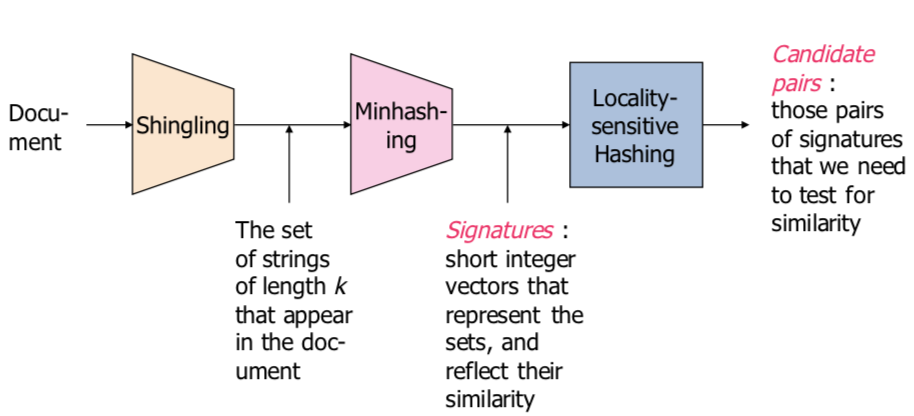


### Shingling

Convert documents to sets. The document is a set of words, as well as the order of words!!!


A *k*-shingle (or *k*-gram) for a document is a sequence of *k* tokens that appears in the doc:

- Tokens can be characters, words or something else, depending on the application
- Assume tokens = characters for examples

__Example:__  $k=2$; Document  $D_1 = abcab$

Set of 2-shingles: $S(D_1) = \{ab, bc, ca\}$.

<u>Represent a doc by its set of $k$-shingles.</u>

Max # of k-shingles for a page of n characters? $N-k+1$.


##### White Spaces

- Better not omit them
-  Could turn multiple into one


##### Shingle Size

- Too small: Many documents will falsely become similar
- Too big: Might miss truly similar documents


#### Working Assumption

- Documents that have lots of shingles in common have similar text, even if the text appears in different order
- **Caveat:** You must pick ***k*** **large enough**, or most documents will have most shingles
  - $k=5$  is ok for short documents (eg. Email, Tweet)
  - $k=8$  is better for long documents
- May want to **compress long shingles**


#### Compressing Shingles

- To **compress long shingles**, we can **hash** them to (say) 4 bytes
  - Called __tokens__
- **Represent a document by the set of hash values of its** ***k*****-shingles**
  - Two documents could (rarely) appear to have shingles in common, when in fact only the hash-values were shared


__Why is compression is needed?__

- How many k-shingles?
  - imagine **20 characters** in alphabet
  - Estimate of number of k-shingles is  $20^k$
  - 4-shingles: $20^4$  or  $160,000$  or  $2^{17.3}$
  - 9-shingles: $20^9$  or  $512,000,000,000$  or  $2^{39}$
- Assume we use **4 bytes** to represent a **bucket**
- Buckets numbered in range  $0$  to  $2^{32} – 1$
- Much smaller than possible number of **9-shingles** and represent each shingle with 4 bytes, not 9 bytes
  - Compression


__Why hash 9-shingles to 4 bytes rather than use 4-shingles?__

- With 4-shingles, most sequences of four bytes are unlikely or impossible to find in typical documents
- Effective number of different shingles much less than $2^{32} – 1$
- With 9-shingles, $2^{39}$  possible shingles
  - Many more than  $2^{32}$  buckets
- After hashing, may get any sequence of 4 bytes


#### Similarity Metric for Shingles

- Document $D_1$  is a set of its k-shingles  $C_1=S(D_1)$
- Equivalently, each document is a vector of 0s,1s in the space of *k*-shingles
  - Each unique shingle is a dimension
  - Vectors are very sparse
- **A natural similarity measure is the** **Jaccard similarity.**


### Minhashing

#### Motivation for Minhash/LSH

**Use k-shingles to create Signatures:** short integer vectors that represent sets and reflect their similarity

- Suppose we need to find near-duplicate documents among million documents
- Naïvely, we would have to compute **pairwise Jaccard similarities** for **every pair of docs**
  - $N = 1\text{ million}$,  $N(N-1)/2 \approx 5 \times 10^{11}$ comparisons


#### From Sets to Boolean Matrices

- __Rows__ = elements of the universal set
  - Example: the set of all k-shingles
- __Columns__ = sets
  - 1 in **row**  $e$  and **column**  $S$ if and only if element  $e$  is a member of set  $S$
  - Column similarity is the Jaccard similarity of the sets of their rows with 1: intersction/union of sets
- **Typical matrix is sparse** (many 0 values)
- May not really represent the data by a boolean matrix
- Sparse matrices are usually better represented by the list of non-zero values


**When Is Similarity Interesting?**

1. When the **sets are so large** or so many that they **cannot fit** in main **memory**
2. when there are **so many sets** that **comparing all pairs** of sets takes **too much time**
3. or both


#### Outline: Finding Similar Columns

1. Compute **signatures** of columns = **small summaries** of columns
2. Examine **pairs of signatures** to find similar signatures
   - **Essential:** **similarities of signatures** and **columns** are related
3. **Optional:** check that columns with similar signatures are really similar.


__Warning:__

1. Comparing **all pairs of signatures** may take **too much time**, even if not too much space
   - A job for __Locality-Sensitive Hashing__
2. These methods can produce false negatives, and even false positives (if the optional check is not made).


__Signatures:__ hash each column C to a small signature  $Sig(C)$, such that

1. $Sig(C)$  is **small** enough that we can fit a signature in **main memory** for each column
2. $Sim(C_1,C_2)$  is the same as the “**similarity**” of $Sig (C_1)$  and  $Sig (C_2)$.


#### Minhashing

1. To ***minhash*** a set represented by a column of the matrix, **pick a random permutation of the rows**
2. **Define**“**hash**”**function  $h(C)$ =the number of the first (in the permuted order) row in which column** ***C*** **has 1**
3. Useseveral(e.g.,100) independent hash functions to **create a signature**.


#### Surprising Property: Connection between Minhashing and Jaccard Similarity

- The probability that minhash function for a **random permutation of rows** produces same value for two sets equals**Jaccard similarity** of those sets
  - **Probability that**  $h(C_1) = h(C_2)$  is the same as  $Sim(C_1, C_2)$
- $Sim(C_1, C_2)$  for both Jacquard and Minhash are  $a/(a+b+c)$ !


#### Similarity of Signatures

- **Sets represented** by characteristic **matrix M**
- **To represent sets:** pick at random some number **n of permutations** of the rows of M
- Call **minhash** functions determined by these permutations  $h_1, h_2, \ldots, h_n$
- From **column representing set S**, construct **minhash signature for S**:
  - vector  $[h_1(S), h_2(S), \ldots, h_n(S)]$,  usually represented as column
- **The** ***similarity of signatures*** **is the fraction of the hash functions in which they agree.**
  - the longer the signatures, the smaller will be the expected error


#### Implementation 

- **Not feasible to permute** a large characteristic matrix explicitly
- Can simulate the effect of a random permutation by a __random hash function__
  - **Maps row** numbers to as many buckets as there are rows
  - May have **collisions on buckets**
  - **Not important as long as number of buckets is large**


```python
for each row r do begin
   for each hash function hi do
      Compute hi (r ) 
   for each column c
      if c has 1 in row r
         for each hash function hi do
            if hi (r ) is a smaller value than M (i, c ) then
               M (i, c ) := hi (r );
```

- Often, data is given by column, not row.
  - columns = documents, rows = shingles.
- If so, sort matrix once so it is by row.
- And *always* compute  $h_i(r)$  only once for each row.


### Locality-Sensitive Hashing


## Week6 - Finding Similar Sets Part 3

This lecture will talk about Local-Sensitive Hashing (LSH), which focus on **pairs of signatures** likely to be from similar documents.

### Motivation for LSH

After using k-shingles and Minhashing, we have to compute __pairwise Jaccard similarities__ for every pair of signatures, which could be a lot of computation. We need to reduce computation intensity!!


### LSH overview

- Hash items several times
  - In a way that **similar items** are more likely to **be hashed to the same bucket** than dissimilar items
- **Candidate Pair:** Any pair that hashes to the same bucket for **any** of the hashings
- **Check only the candidate pairs for similiarity**
- **False positives** **:** **dissimilar pairs** that hash to the same bucket
- **False negatives:** **truly similar** pairs do **not** hash to the same bucket for at least one of the hash functions.


### LSH

- __Goal:__ **Find documents with Jaccard similarity at least** ***s*** for some similarity threshold ***s*** (e.g. ***s***=0.8)
- **LSH –** **General idea:** Use a function ***f(x,y)*** that tells whether***x*** and ***y*** are a ***candidate pair****:* a pair of elements whose similarity must be evaluated
- For Min-Hash Matrix:
  - Hash columns of signature matrix ***M*** to many buckets
  - Each pair of documents that hashes into the same bucket is a **candidate pair.**

- (We expect documents ***x*** and ***y*** to have the same **(Jaccard) similarity as their signatures.**)


__LSH for Min-Hashing:__

- __Big idea:__ **Hash columns of signature matrix** ***M*** **several times**
- Arrange that (only) **similar columns** are likely to **hash to the same bucket**, with high probability
- **Candidate pairs are those that hash to the same bucket.**
- Detiled steps:
  - Divide matrix ***M*** into ***b*** bands of ***r*** rows
  - For each band, hash its portion of each column to a hash table with ***k*** buckets
    - Make ***k*** as large as possible
    - Use a **separate bucket array for each band** so columns with the same vector in **different bands don’t hash to same bucket**
  - ***Candidate*** **column pairs** are those that **hash to the same bucket for** ≥ **1 band**
  - Tune ***b*** and ***r*** to catch most similar pairs, but few non-similar pairs.


#### LSH involves a tradeoff

- Pick:

  - The number of Min-Hashes (rows of ***M***)
  - The number of bands ***b***
  - The number of rows ***r*** per band

  to balance false positives/negatives

- **Example:** If we had only 15 bands of 5 rows, the number of **false positives would go down**, but the number of **false negatives would go up**.

Form of an S-curve, regardless of values of  $b$  and  $r$, threshold s is where rise of curve is steepest: approximately  $(1/b)^{1/r}$.

__Example:__

- $(1/b)^{1/r}$ **represents the threshold of the S curve for function**
- $1 - (1 - t^r)^b$, the probability of being a candidate pair
- **To avoid false negatives**:  Select $b$ and  $r$  to produce a threshold lower than  $s$
- **To avoid false positive**:  Select $b$  and  $r$  to produce a threshold higher than  $s$


#### LSH Summary

- Tune ***M, b, r*** to identify **almost all candidate pairs with similar signatures**, but **eliminate most pairs that do not have similar signatures**
- Then **check in main memory that candidate pairs really do have** **similar signatures**
- **Optional:** In another pass through data, check that**the remaining candidate pairs really** **represent similar documents.**


### Family of Functions for LSH

- **Families of functions** (including minhash functions) that can serve to **produce candidate pairs efficiently**
  - Space of sets and Jaccard distance OR other space and/or distance measure
- **Three conditions for family of functions:**
  1. **More likely to make close pairs be candidate pairs than distant pairs**
  2. **Statistically independent**
  3. **Efficient** in two ways
     - **Be able to identify candidate pairs in time much less than time to look at all pairs**
     - **Combinable to build functions better at avoiding false positives and negatives** 


#### LSH for other distance measures

- We focused on **minhashing**, a locality sensitive hashing family that uses **Jaccard distance**
  - Based on sets representing documents and their Jaccard similarity
- LSH families for **other distance measures**:
  - **Euclidean distance:** based on the locations of points in a __Euclidean space__ with some number of real-valued dimensions
  - **Cosine distance:** **angle between vectors** from the origin to the points in question
  - **Edit distance:** **number of inserts and deletes** to change one string into another
  - **Hamming Distance:** **number of positions** in which bit vectors differ


### LSH and Shingling Application Examples

#### Matching fingerprints

__Representation of fingerprint:__

- Typical representation is not an image, but **set of locations in which minutiae are located**
  - **Place where something unusual happens**: two ridges merging or a ridge ending
- Place a grid over a fingerprint
  - Normalize for **size and orientation** so that identical prints will overlap
- Represent fingerprint by **set of grid points** where**minutiae are located**
  - Possibly, **treat minutiae near a grid boundary** as if also present in adjacent grid points


__Applying LSH to Fingerprints:__

- **Make a bit vector for each fingerprint’s set of grid points with minutiae**

  - Similar to set representing a document: 1 if the shingle is in the document, 0 otherwise

- minhash the bit vectors to obtain signatures:

  - But since there probably aren’t too many grid points, we can work from the bit-vectors directly

- **Many-to-many version of fingerprint matching:** take an entire database of fingerprints and identify if there are **any pairs** that represent the **same individual**

  - **Analogous to finding similar documents among millions of documents**

  - **Define a locality-sensitive family of hash functions:**
    - Each function f in the family F is defined by **3 grid squares**
    - Function f says “yes” for two fingerprints if both have minutiae in all **three grid squares, otherwise, f says “no”**
    - “Yes” means the two fingerprints are candidate pairs
    - Sort of “bucketization”:
      - Each set of **three points creates one bucket**
      - Function f sends fingerprints to its bucket that have minutae in all three grid points of f
  - Compare all fingerprints in each of the buckets.

- __Many-to-one version:__ A fingerprint has been found at a crime scene, and we want to **compare it with all fingerprints in a large database to see if there is a match**

  - Could use many functions f from family F
  - **Precompute their buckets of fingerprints to which they answer “yes” on the large database**
  - For a new fingerprint:
    - Determine which buckets it belongs to
    - Compare it with all fingerprints found in any of those buckets


#### Identifying similar news articles

- **Want to organize large repository of on-line news articles**
  - **Group together web pages derived from same basic text**
- **Scenario:** the same article, say from the Associated Press, appears on the Web site of many newspapers, but looks quite different
- Each newspaper surrounds the text of the article with:
  - Its own logo and text
  - Ads
  - Perhaps links to other articles
- A newspaper may also "crop" the article (delete parts).


__Variation on shingling:__

- **Looks like earlier problem:** find documents whose shingles have high Jaccard similarity
- **But: Shingling treats all parts of document equally**
- For this application, **we want to ignore parts of the documents** (ads, links to other articles, etc.)
- There is a difference between text that appears in prose and text in ads or headlines/links
  - Prose contains greater frequency of ***stop words***
  - Common to use list of several hundred most frequent words.
- **News articles have a lot of stop words, while ads do not**
- **Define a** ***shingle*** **to be a stop word plus the next two** **following words**
- **Then compare the similarity of the sets of shingles that represent each document**
  - Don’t use minhashing or LSH in this example


__Why it Works?__

- By requiring each shingle to have a stop word**:** **bias the mapping from documents to shingles** so it picked more shingles from the article than from the ads
- **Pages with the same article, but different ads,**have **higher Jaccard similarity** than those with the same ads, but different articles


## Week7 - Recommender System 1-2

### Introduction and Background

__Motivation: the long tail__

- From scarcity to abundance:
  - Shelf space is a scarce commodity for traditional retailers
- Web enables near-zero-cost dissemination of information about products
- More choice necessitates better filters


__Types of Recommendations:__

- Editorial and hand curated
  - List of favorites
  - Lists of "essential" items
- Simple aggregates
  - Top 10, Most Popular, Recent Uploads
- Tailored to individual users
  - Amazon, Netflix, ...


### Formal Model

- __X =__ set of Customers

- __S =__ set of Items

- Users have preferences for certain items
- Want to extract preferences from data
- __Utility function u: X $\times$ S $\to$ R__
  - __R =__ set of ratings
  - __R__ is a totally ordered set
  - e.g., 0-5 stars, real number in $[0,1]$


__Utility Matrix:__

- For each user-item pair, value represents degree of preference that user for that item (e.g., rating)
- Matrix is sparse (most entries unknown)


__Key problems:__

1. Gathering “known” ratings for matrix
   - How to collect the data in the utility matrix
2. Extrapolate unknown ratings from the known ones
   - Mainly interested in **high unknown ratings**
     - We are not interested in knowing what you don’t like but what you like
     - To generate revenue
3. Evaluating extrapolation methods
   - How to measure success/performance of recommendation methods.


#### Gathering Ratings

- Explicit:
  - Ask people to rate items
  - Doesn’t work well in practice – people can’t be bothered
- Implicit:
  - Learning ratings from user actions
    - purchase implies high rating


#### Extrapolating Utilities

- __Key problem:__ Utility matrix __U__ is __sparse__
  - Most people have not rated most items
  - __Cold start:__
    - New items have no ratings
    - New users have no history
- Three approaches to recommender systems
  - Content-based
    - Use characteristics of an item
    - Recommend items that have similar content to items user liked in the past
    - items that match pre-defined attributes of the user
  - Collaborative filtering
    - Build a model from a user's past behavior (items previously purchased or rated) and similar decisions made by other users
    - Use the model to predict items that the user may like
    - Collaborative: suggestions made to a user utilize information across the entire user base
  - Hybrid approaches


### Content-based Recommendations

- __Main idea:__ Recommend items to customer  $x$  that are similar to previous items rated highly by  $x$
  - Requires characterizing the content of items in some way


#### General Strategy for Content-Based Recommendations

- Construct item profiles
  - Explicit features in a database, discovering features in documents, Tags
  - Create vectors representing items
    - Boolean vectors indicate occurrence of high TF.IDF word
    - Numerical vectors might contain ratings
- Construct user profiles
  - Create vectores with same components that describe user's preferences
- Recommend items to users based on content
  - Calculate cosine distance between item and user vectors
  - Classification algorithms


#### Item Profiles

- For each item, create an **item profile**
- **Profile is a set (vector) of features**
  - **Movies:** screenwriter, title, actor, director,...
  - **Text:** Set of “important” words in document


##### Item Profiles Based on Textual Content

-  Can treat this as an **Information Retrieval task (IR)**
- Recommend items (web pages, books, movies) based on associated textual content


__TF-IDF: Measure of Word Importance__

- Classification of documents as being about similar things starts with finding significant words in those documents

- Not most frequent words

  - (The, and, a, ...) called "stop words"

- Not just rare words either

- Want concentration of useful words in just a few documents

- Usual heuristic from text mining is **TF-IDF:**

  $\text{term frequency} \times \text{inverse Doc frequency}$

- Words with highest TF.IDF score are often the terms that best characterize the topic of a document

- When constructing an item profile for Recommender system:

  - Term ... Feature
  - Document ... Item


$f_{ij} = \text{frequency of term (feature) } i \text{ in ducument (item) } j$

Term frequency: $TF_{ij} = \frac{f_{ij}}{\max_k{f_{kj}}}$

- Term frequency of term  $i$  in document  $j$  is **normalized**
- Divide by maximum occurrences of any term in document  $j$
- Most frequent term has  $TF = 1$


$n_i = \text{number of docs that mention term } i$

$N=\text{ total number of docs}$

Inverse Document Frequency: $IDF_i = \log_2{(N/n_i)}$

TF-IDF score: $w_{ij} = TF_{ij} \times IDF_i$

**Item profile for a document =** **set of words with highest TF-IDF scores, together with their scores.**

 


#### Make recommendations based on Feature Documents

- Want to suggest articles, pages, blogs a user might want to see
- Hard to classify items by topic
- In practice, **try to identify words that characterize the topic of a document**
- **Eliminate stop words:** several hundred most common words
- **For remaining words, calculate the TF.IDF score** for each word in the document
- **The words with the highest TF.IDF scores characterize the document**


1. Represent documents by a set of words
   - **Take as features of the document** **the** ***n*** **words with highest TF.IDF scores**
     - Could pick **same** ***n*** **for all documents**
     - Or let ***n*** **be fixed percentage** of words in the document
     - Could also make **all words with TF.IDF scores above a given threshold** are part of feature set
   - Documents then represented by set of words
   - <u>Expect these words to express subjects or main ideas of documents</u>
   - Then can measure the similarity of two documents using:
     - Cosine distance between the sets, treated as vectors
     - Jaccard distance between sets of word


__Cosine distance between 2 boolean vectors:__

- **Vector has 1 if word is in the set** for that document and 0 if not

- Between two documents, only a finite number of words among their two sets

- Almost all components are 0; do not affect dot product

- **Dot products** are size of **intersection of the two sets** of words

- **Lengths of vectors** are square roots of number of words in each set

- Cosine of angle between vectors: dot product divided by product of vector lengths:
  $$
  \text{similarity} = \cos(\theta) = \frac{A \cdot B}{\lVert A \rVert \cdot \lVert B \rVert}
  $$


**Another Option to Describe Item Content: Obtaining Item Profile Features from Tagging Systems:**

- Useful for content-based recommendations for **images**
- Users enter words or phrases that describe items
- GPS information/geofilters: e.g., automatically add location information when a photo is uploaded
- **Can use tags as a recommender system**
  - if user retrieves or bookmarks pages with certain tags, recommend other pages with same tags
- Only works if users create tags or allow automatic geotagging.


#### User Profiles

__General Strategy for Content-Based Recommendations:__

- construct item profiles

  - Create vectors representing items

- Construct user profiles

  - Create **vectors** with same components that **describe user’s preferences**
  - Best estimate regarding which items a user likes is **some aggregation of the profiles of those items**

- **User profile possibilities:**

  - Boolean utility matrix

  - **Non-boolean utility matrix: (e.g., ratings)** weight the vectors representing

    profiles of items by utility (rating) value

- Recommend items to users based on content

  - Calculate cosine distance between item __i__ and user vectors  __u__ as the degree to which the user would prefer this item
  - Classification algorithms
    - Use **machine learning techniques**
    - Regard given data as a training set
    - For each user, **build a classifier that predicts the rating of all items**
    - Ratings on a scale of 1 to k can be directly mapped to k classes
    - Many different classifiers:
      - NaïveBayesclassifier
      - K-nearestneighbor
      - Decision trees
      - Neuralnetworks


#### Decision Tree

__Classifiers:__

- Classifiers of all types take a long time to construct
  - for decision trees: need one tree per user
- Constructing a tree requires looking at all item profiles
- Have to consider many different predicates
- Could involve complex combinations of features
- Typically applied only to small problem sizes


#### Summary for Content-Based Recommendations

- No need for data on other users
- Able to recommend to users with unique tastes
- Able to recommend new & unpopular items
- Able to provide explanations

However,

- Finding the appropriate features is hard
- Have problem with recommendations for new users (how to build user profile)
- Overspecialization
  - Never recommends items outside user’s content profile
  - People might have multiple interests
  - **Unable to exploit quality judgments of other users (don’t use ratings!).**


- Scale components with values that are not boolean (e.g., ratings)
- Use Random hyperplanes (RH)* and Locality Sensitive Hashing (LSH) techniques to place item profiles (i vectors) in buckets
- **For a given user (x vector), apply RH and LSH techniques:****identify in which bucket we look for items that might have a** **small cosine distance from user.**


### Collaborative Filtering

> __Example__
>
> - **User-based** collaborative filtering
> - Consider user __x__
>   - Find set **N** of other users whose ratings are “**similar**” to __x__’s ratings
>   - Estimate **x**’s ratings based on ratings of users in **N**


#### Overview

- CF works by **collecting user feedback**: **ratings for items**
  - Exploit similarities in rating behavior among users in determining recommendations
- Two classes of CF algorithms:
  - **Neighborhood-based or Memory-based approaches**
    - User-based CF
    - Item-based CF
  - __Model-based approaches__
    - Estimate parameters of statistical models for user ratings
    - Latent factor and matrix factorization models


#### Neighborhood-based Collabrative Filtering: User-based CF

- Active user: the user we want to make predictions for
- **User-based CF:** A subset of other users is chosen based on their similarity to the active user
- A weighted combination of their ratings is used to make predictions for the active user
- Steps:
  1. Assign a weight to all users w.r.t. **similarity with the active user**
  2. **Select** **k** **users that have the** **highest similarity** with active user (the neighborhood)
  3. **Compute a prediction from a weighted combination of the selected neighbors’ ratings.**


__Similarity between users: by what measure?__

- **Weight $w_{x,y}$ is measure of similarity between user  $x$  and active user  $y$**
- Let  $r_x$ be the vector of user $x$'s ratings
- __Jaccard similarity__
- __Cosine similarity__
- __Normalized cosine similarity__ (subtract the average rating of that user from each rating)


> __Pearson Correlation :__
>
> - **Pearson correlation measures extent to which two variables linearly relate**
>
> - For user  __u__, __v__: Pearson correlation is
>   $$
>   w_{u,v} = \frac{\sum_{i\in I}{(r_{u,i} - \bar{r}_u)(r_{v,i} - \bar{r}_v)}}{\sqrt{\sum_{i\in I}(r_{u,i} - \bar{r}_u)} \sqrt{\sum_{i\in I}(r_{v,i} - \bar{r}_v)}}
>   $$
>
> - **Note: When calculating these similarities, look only at the co-rated items.**


__Making User-based CF predictions with Pearson: Weighted sum of other user's ratings__

- Weighted average of their ratings is used to generate predictions

- To make a prediction for an active user  $a$  on an item  $i$:
  $$
  P_{a,i} = \bar{r}_a + \frac{\sum_{u \in U}{(r_{u,i} - \bar{r}_u)\cdot w_{a,u}}}{\sum_{u\in U}{|w_{a,u}|}}
  $$
  Where  $\bar{r}_a$  and  $\bar{r}_u$  are the average ratings for the user  $a$  and user  $u$  on all other rated items, and $w_{a,u}$  is the weight between the user  $a$  and $u$. The summations are over all the users  $u \in U$  who have rated the item  $i$.

- __Note:__ When making predictions, calculate average of ALL co-rated items for users  $a$  and  $u$

- **Summation is over all users who rated item i.**


__Summary:__

- In neighborhood-based CF algorithms, **a subset of nearest neighbors** of the active user are **chosen based on their similarity with active user**
- Use these for predictions rather than all users who have rated the item.


#### Neighborhood-based Collabrative Filtering: Item-based CF

- Neighborhood-based CF algorithms **do not scale well** when applied to millions of users & items
  - Due to computational complexity of search for similar users
- **Item-to-item collaborative filtering**
  - Rather than matching similar users
  - **Match user’s rated items to similar items**
- In practice, often leads to <u>faster online systems and better recommendations</u>
- **Similarities between pairs of items i and j are computed off-line**
- Predict rating of <u>user **a**</u> on <u>item **i**</u> with a simple weighted average.


For the item-based algorithm, denote the set of users  $u \in U$ who rated both items  $i$  and  $j$, then the Pearson Correlation will be
$$
w_{i,j} = \frac{\sum_{u\in U}{(r_{u,i} - \bar{r}_i)(r_{u,j} - \bar{r}_j)}}{\sqrt{\sum_{u\in U}(r_{u,i} - \bar{r}_i)^2} \sqrt{\sum_{u\in U}(r_{u,j} - \bar{r}_j)^2}}
$$
where  $r_{u,i}$  is the rating of user  $u$  on item  $i$,  $\bar{r}_i$  is the average rating of the  $i$th item by those users.

- **Note: Sum over set of users** ***U*** **who rated both items** ***i, j***
- $r_{u,i}$  is rating of user  $u$  on item  $i$
- $\bar{r}_i$ is average rating of  $i$th item by those users


__Make item-based predictions using weighted average:__

- Predict rating for user $u$  on item  $i$

- $w_{i,n}$  is weight between item  $i$  and  $n$

- $r_{u,n}$  is rating for user  $u$  on item  $n$

- Summation over **neighborhood set** ***N*** **of** **items** rated by  $u$  that are most similar to  $i$
  $$
  P_{u,i} = \frac{\sum_{n\in N}{r_{u,n} w_{i,n}}}{\sum_{n\in N}{|w_{i,n}|}}
  $$
  


#### Item-Item vs. User-User

- In theory, user-user and item-item are dual approaches
- In practice, item-item outperforms user-user in many use cases
- Items are "simpler" than users
  - Items belong to a small set of "genres", users have varied tastes
  - Item Imilarity is more meaningful than User Similarity


#### Pros/Cons of Collaborative Filtering

- Pros:
  - __Works for any kind of item__: No feature selection needed
- Cons:
  - __Cold Start:__ Need enough users in the system to find a match
  - __Sparsity:__
    - The user/ratings matrix is sparse
    - Hard to find uders that have rated the same items
  - __First rater:__
    - Cannot recommend an unrated item
    - New items, Esoteric items
  - __Popularity bias:__ Tend to recommend popular items

 

## Week9 - Recommender System 3-4

### Extensions to Memory-based Algorithms

- A variety of approaches/extensions have been studied to improve the performance of CF predictions

- Typically involve **modifying the similarity weights** or the **ratings** used in predictions or **guessing missing ratings**

- __User-based CF:__
  $$
  w_{u,v} = \frac{\sum_{i\in I}{(r_{u,i} - \bar{r}_u)(r_{v,i} - \bar{r}_v)}}{\sqrt{\sum_{i\in I}(r_{u,i} - \bar{r}_u)} \sqrt{\sum_{i\in I}(r_{v,i} - \bar{r}_v)}}
  $$

  $$
  P_{a,i} = \bar{r}_a + \frac{\sum_{u \in U}{(r_{u,i} - \bar{r}_u)\cdot w_{u,a}}}{\sum_{u\in U}{|w_{a,u}|}}
  $$

- __Item-based CF:__
  $$
  w_{i,j} = \frac{\sum_{u\in U}{(r_{u,i} - \bar{r}_i)(r_{u,j} - \bar{r}_j)}}{\sqrt{\sum_{u\in U}(r_{u,i} - \bar{r}_i)^2} \sqrt{\sum_{u\in U}(r_{u,j} - \bar{r}_j)^2}}
  $$
  
  $$
  P_{u,i} = \frac{\sum_{n \in N}{r_{u,n}\cdot w_{i,n}}}{\sum_{n\in N}{|w_{i,n}|}}
  $$


#### Default Voting

- In many collaborative filters, **pairwise similarity is computed only from the ratings in the intersection of the items both users have rated (“co-rated items”)**
  - **Not reliable when there are too few votes** to generate similarity values (U is small)
  - Focusing on co-rated items (“intersection set similarity”) also**neglects** **global rating** **behavior reflected in a user’s entire rating history**
- Assuming some default voting values for the missing ratings: **can improve CF prediction performance.**


**Approaches to default voting values:**

- Herlocker et al. accounts for small intersection sets (small number of co-rated items) by **reducing the weight of users that have** **fewer than 50 items in common**
  $$
  P_{u,i} = \frac{\sum_{n\in N}{r_{u,n} w_{i,n}}}{\sum_{n\in N}{|w_{i,n}|}}
  $$

- Chee et al. **use average of the clique(small group of co-rated items) as a default voting** to extend a user’s rating history

- Breese et al. **use a neutral or somewhat negative preference for the unobserved ratings** and then computes similarity between users on the resulting ratings data.


#### Inverse User Frequency

- **Universally liked items are not as useful in capturing similarity as less common items**

- Inverse frequency

  - $f_j = \log{(n/n_j)}$
  - $n_j$ is number of users who have rated item $j$
  - $n$ is total number of users

- If everyone has rated item  $j$, then $f_j$  is zero

- __Approach: transform the ratings__

  - For vector similarity-based CF: new rating = original rating multiplied by  $f_j$
    $$
    P_{a,i} = \bar{r}_a + \frac{\sum_{u\in U}{(r_{u,i} - \bar{r}_u)\cdot w_{a,u}}}{\sum_{u\in U}{|w_{a,u}|}}
    $$

  - For every popular items, rating  $r_{u,i}$  will be greatly reduced

  - Less popular items will have greater effect on prediction


#### Case Amplification

- Transform applied to weights used in CF prediction

- Emphasizes high weights and punishes low weights
  $$
  w'_{i,j} = w_{i,j} \cdot |w_{i,j}|^{\rho-1}
  $$
  typical  $\rho$  is $2.5$

- **Reduces noise in the data**

- **Favors high weights**

- Small values raised to a power become negligible


#### Imputation-Boosted CF

- When the rating data for CF tasks are extremely sparse: hard to produce accurate predictions using the Pearson correlation-based CF
- Su et al. proposed imputation-boosted collaborative filtering (IBCF)
- **First uses an imputation technique to fill in missing data**
  - **imputation** is the process of replacing missing data with substituted values
- **Then use traditional Pearson correlation-based CF algorithm** on this completed data to predict a user rating for a specified item
  - mean imputation, linear regression imputation, predictive mean matching imputation, Bayesian multiple imputation, and machine learning classifiers (including naıve Bayes, SVM, neural network, decision tree, lazy Bayesian rules)


### Evaluating Recommender Systems

#### The Netflix Prize

- Training data
  - 100 million ratings, 480,000 users, 17,770 movies
  - 6 years of data: 2000-2005
- Test data
  - Last few ratings of each user (2.8 million)
  - **Evaluation criterion:** Root Mean Square Error (RMSE)
  - Netflix system RMSE: 0.9514
- Competition
  - **$1 million** prize for 10% improvement on Netflix


#### Evaluation

- __Goal:__ Make good recommendations
  - Quantify goodness using __RMSE__:Lower RMSE $\to$ better recommendations
  - Want to make good recommendations on items that user has not yet seen. 


#### Collaborative Filtering Overview

CF works by **collecting user feedback**: **ratings for items**

- Exploit similarities in rating behavior among users in determining recommendations


__Two classes of CF algorithms:__

1. Neighborhood-based or Memory-based approaches
   - User-based CF
   - Item-based CF
2. Model-based approaches
   - Estimate parameters for statistical models for user ratings
   - Latent factor and matrix factorization models


### Model-Based CF

- Provide recommendations by estimating parameters of statistical models for user ratings

- Design and development of models can allow system to learn to recognize complex patterns

  - Based on training set – supervised learning

- Then make intelligent predictions for CF tasks based on

  the **learned models**

- Examples:

  - Bayesian models
  - Clustering models
  - Dependency networks
  - Classification algorithms (if users rating are in categories)
  - Regression models and SVD methods for umerical ratings


#### Clustering CF

- Cluster = collection of data objects that are:

  - Similar to one another within the same cluster
  - Dissimilar to objects in other clusters

- Measurement of similarity between objects uses:

  - Pearson correlation

  - Cosine similarity

  - Minkowski distance

    - Two objects  $X=(x_1,x_2,\ldots,x_n), Y=(y_1,y_2,\ldots,y_n)$

    - Where  $q$  is a positive integer

    - If  $q=2$ : Euclidean distance
      $$
      d(X,Y) = \sqrt[q]{\sum_{i=1}^n{|x_i - y_i|^q}}
      $$


__Clustering Algorithms:__

- Common clustering method
  - K-Means
  - Hierarchical Clustering
  - Mean-Shift
- Key operation: Repeatedly combine two nearest clusters
- **Euclideancase:** each cluster has a ***centroid*** = average of its (data)points


##### K-means Algorithm

- Assumes Euclidean space/distance
- Start by picking ***k***, the number of clusters
- Initialize clusters by picking one point per cluster
- Populating clusters:
  1. For each point, place it in the cluster whose current centroid it is nearest
  2. After all points are assigned, update the locations of centroids of the ***k*** clusters
  3. Reassign all points to their closest centroid (Sometimes moves points between clusters)
  4. Repeat 2 and 3 util convergence


##### Clustering CF Algorithms

- Clustering is an intermediate step
- Resulting clusters used for further analysis or precessing
  - For classification and other tasks
  - Example: partition data into clusters; then use memory-based CF algorithm like Pearson correlation to make predictions within each cluster
- Clustering algorithms have **better scalability than typical CF methods** because they **make predictions on smaller clusters rather than whole customer base**
- **Complex and expensive clustering computation run offline**
- **Recommendation quality is generally low**
- Optimal clustering over large data sets is impractical
  - Most applications use greedy cluster generation techniques

#### Regression-based CF

- For memory-based CF algorithms: **in some cases, two rating vectors may have:**

  - Large Euclidean distance
  - but have very high similarity using vector cosine or Pearson correlation measures **- noise**

- Numerical ratings are common in real recommender

  systems

- Regression methods: good at making predictions for numerical values

- **Uses an approximation of the ratings to make predictions based on a regression model.**


__Linear regression:__

- Data are modeled using <u>linear predictor functions</u>, and unknown model <u>parameters</u> are <u>estimated</u> from the data
- Such models are called *linear models*
- If the goal is prediction, forecasting, or reduction, linear regression can be used to **fit a predictive model to an observed data set of** ***y*** **and** ***X*** **values**
- After developing such a model, if an additional value of *X* is then given without its accompanying value of *y*
  - the fitted model can be used to **make a prediction of the value of** ***y***


##### Regression method

- Let  $X=(X_1, X_2, \ldots, X_m)$  be a random variable representing <u>user's preference</u> on different items

- Linear regression method:

  $Y = \Lambda X + N$

  $\Lambda$ is an  $n\times k$  matrix

  $N=(N_1,N_2,\ldots,N_n)$  is a random variable representing Noise in user choices

  $Y$ is an $n\times m$ matrix where  $Y_{ij}$  is rating of user  $i$  on item  $j$

  $X$  is a  $k \times m$  matrix with each column as estimate of the value of the random variable  $X$ (user's rating in k-dimensional rating space for one user)


### Characteristics and Challenges of Collaborative Filtering

__Data Sparsity:__

- Many commercial recommender systems are used with very large product sets
- Most users do not rate most items: User-item matrix is extremely sparse
- For CF: reduces probability of finding set of users with similar ratings

- Approaches:
  - **Dimensionality reduction techniques**
    - SVD: remove unrepresentative or insignificant users or items to reduce size of user-item matrix
    - Latent semantic Indexing: similarity between users is determined by representation of users in reduced space
    - Principle Component Analysis


__Cold start problem:__

- When a new user or item has just entered the system
- **New item problem:** can’t be recommended until some users rate it
- **New users**: not given good recommendations because of lack of rating or purchase history
- __Approaches:__
  - **Content-based systems** do not rely on ratings from other users
  - **Hybrid CF (content-boosted CF)**: external content information can be used to produce predictions for new users or new items


__Synonyms:__

- **Same or very similar items that have different names or entries**

- Most recommender systems are unable to discover this latent association

- Treat these products differently

- **Synonyms decrease recommendation performance of CF**

  **systems**

- __Approaches:__

  - **Automatic term expansion** or **construction of thesaurus**
    - Some added terms may have different meanings than  intended
  - __SVD: Latent semantic Indexing (LSI):__ construct a semantic space where terms and documents that are closely associated are placed close to each other


__Scalability:__

- **Traditional CF systems suffer scalability problems at very large scale**
- Approaches:
  - **Dimensionality reduction (SVD)** can scale and quickly produce good recommendations (expensive matrix factorization)
  - Memory-based CF algorithms (e.g., **item-based Pearson correlation CF algorithm**) have good scalability


**Gray Sheep:**

- Users whose opinions **do not consistently agree or disagree with any group of people**

- Do not benefit from collaborative filtering

- Approaches:

  - **Hybrid approach combining content-based and CF recommendations**

  - Base prediction on **weighted average of content-based prediction and CF prediction**

  - Weights are determined on a per-user basis

  - System determines optimal mix of content and CF-based

    recommendations


__Black sheep:__ Idiosyncratic tastes make recommendations nearly impossible: considered an acceptable failure

### Hybrid Recommendation Systems

1. **Weighted:** The score of different recommendation components are combined numerically
2. **Switching:** The system chooses among recommendation components and applies the selected one.
3. **Mixed:** Recommendations from different recommenders are presented together.
4. **Feature Combination:** Features derived from different knowledge sources are combined together and given to a single recommendation algorithm.
5. **Feature Augmentation:** One recommendation technique is used to compute a feature or set of features, which is then part of the input to the next technique.
6. **Cascade:** Recommenders are given strict priority, with the lower priority ones breaking ties in the scoring of the higher ones.
7. **Meta-level:** One recommendation technique is applied and produces some sort of model, which is then the input used by the next technique.


## Week 10 - Social Networks 1

__Overlapping communities:__

- Non-overlapping vs. overlapping communities

  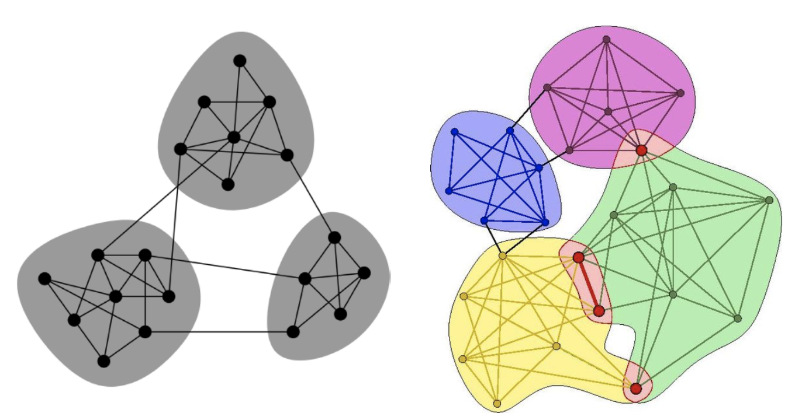

__Non-overlapping Communities:__

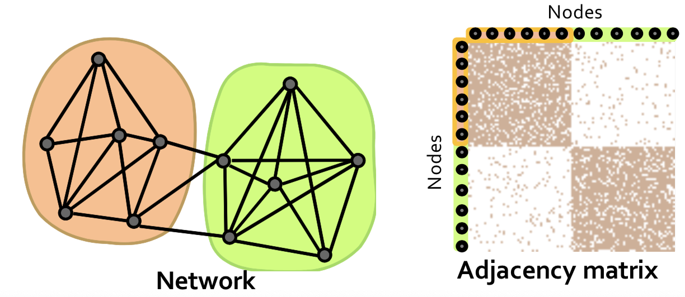


What's the structure of community overlaps?

<u>Edge density in the overlaps is higher!</u>

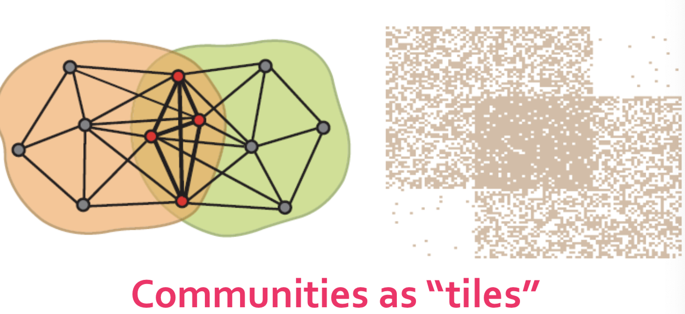


__Plan of attack:__

1. Given a model, we generate the network:

   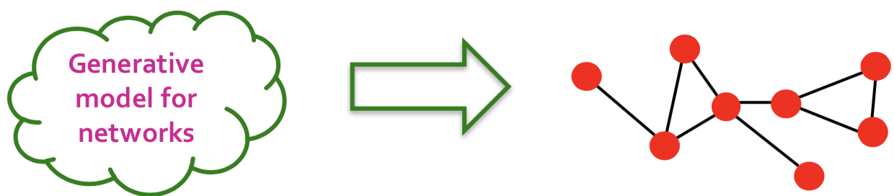

2. Given a network, finding the "best" model

   


### Model of Networks

__Goal:__ Define a model that can generate networks

- The model will have a set of “**parameters**” that we will later want to estimate (and detect communities)

__Q:__ Given a set of nodes, how do communities "generate" edges of the networks?


#### Affiliation-Graph Model

##### Community-Affiliation Graph

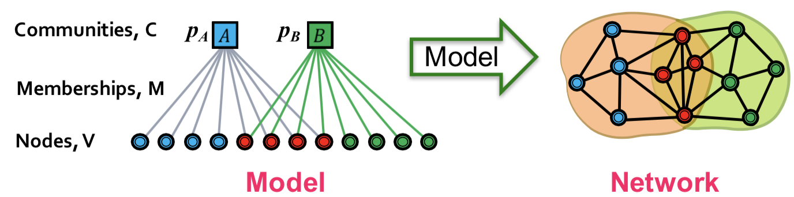

__Generative model  B(V, C, M, {$p_c$}) for graphs:__

- Nodes V, Communities C, Memberships M
- Each community c has a single probability $p_c$
- Later we fit the model to networks to detect communities.

__Affiliation Graph Model (AGM) generates the links:__

For each pair of nodes in community A, we connect them with prob $p_A$.

The overall edge probability is:
$$
P(u,v) = 1 - \prod_{c\in M_u \cap M_v}{(1-p_c)}
$$
Where $M_u$ is the set of communities node $u$ belongs to.

__Advantages of AGM:__

- __Flexibility:__ AGM can express a vatiety of community structures, including non-overlapping, overlapping, nested)

  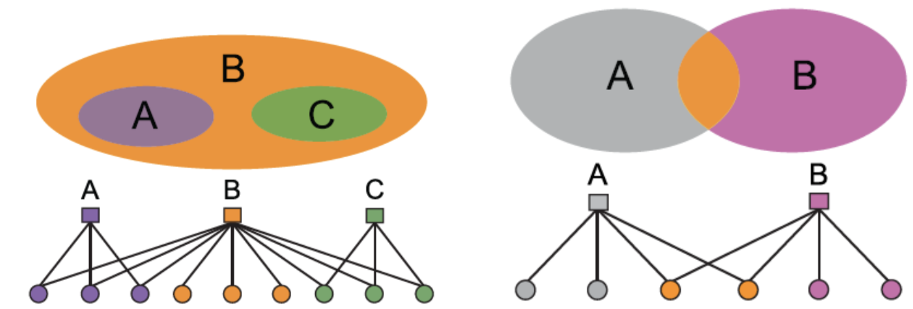

  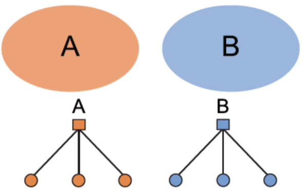


#### How do we detect communities with AGM?

Detecting communities with AGM: Given a gaph G(V, E), find the model:

1. Affiliation graph M
2. Number of communities C
3. Parameters $p_c$


**Maximum Likelihood Principle (MLE):**

- Given: Data  $X$

- Assumption: Data is generated by some model  $f(\Theta)$

  - $f$: model
  - $\Theta$: model parameters

- Want ot estimate  $P_f(X|\Theta)$:

  - The probability that our model  $f$ (with parameters  $\Theta$) is generated the data 

- Now let’s find the most likely model (including the parameters) that could have generated the data:
  $$
  {\arg \max}_{\Theta} P_f(X|\Theta)
  $$
  

Given graph G(V, E) and $\Theta$, we calculate likelihood that $\Theta$ generate G: $P(G|\Theta)$:
$$
P(G|\Theta) = \prod_{(u,v)\in E}{P(u,v)} \prod_{(u,v) \notin E}{(1-P(u,v))}
$$


__MLE for Graphs:__

- __Goal:__ Find  $\Theta=B(V,C,M,\{p_c\})$  such that ${\arg \max}_{B(V,C,M,\{p_c\})} \prod_{(u,v)\in E}{P(u,v)} \prod_{(u,v) \notin E}{(1-P(u,v))}$
- __Problem:__ Finding B means finding the bipartite affiliation network
  - There is no nice way to do this
  - Fitting $B(V,C,M,\{p_c\})$ is too hard

<u>BIGCLAM is an easier model to fit!!!!!</u>


#### From AGM to BigCLAM

__Relaxation:__ Memberships have strengths (avoid discrete membership changes)


- $F_{uA}$: The membership strength of node  $u$  to community  $A$ (>0) (ig $F_{uA}=0$, then no membership)

- Each community $A$ links nodes independently. Define:
  $$
  P_A(u,v) = 1 - \exp(-F_{uA} \cdot F_{vA})
  $$


__Community membership strength matrix F:__

- $P_A(u,v) = 1 - \exp(-F_{uA} \cdot F_{vA})$

  - Probability of connection is proportional to the preduct of strengths
    - If one node doesn't belong to the community ($F_{uC} = 0$) then $P_C(u,v) = 0$

- Probability that at least one common community C links the nodes:
  $$
  P(u,v) = 1 - \prod_C{(1- P_C(u,v))}
  $$
  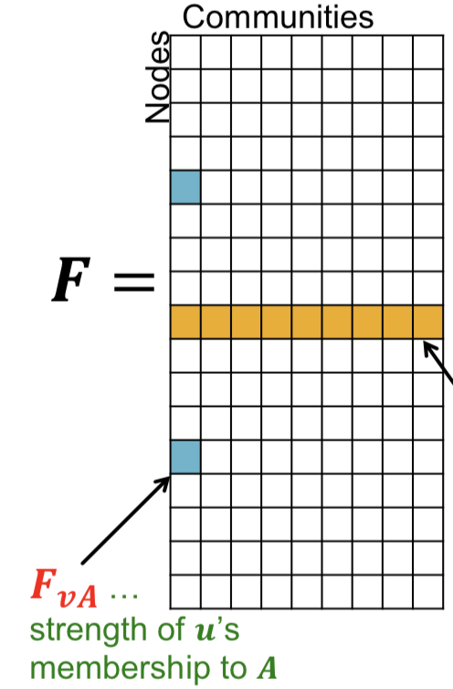

- Community A links nodes $u$, $v$ independently:
  $$
  P_A(u,v) = 1 - \exp(-F_{uA} \cdot F_{vA})
  $$

- Then the probability at least one common C links them:
  $$
  \begin{align}
  P(u,v) &= 1 - \prod_C{(1-P_C{(u,v)})}\\
         &= 1- \exp(-\sum_C{F_{uC} \cdot F_{vC}})\\
         &= 1 - \exp(-F_u \cdot F_v^T)
  \end{align}
  $$
  

#### BigCLAM: How to find F

__Task:__ Given a network G(V, E), estimate F

- Find F that maximizes the likelihood:
  $$
  \arg\max_{F}{\prod_{(u,v)\in E}{p(u,v)} \prod_{(u,v)\notin E}{(1-p(u,v))}}
  $$
  where $P(u,v) = 1 - \exp(- F_u \cdot F_v^T)$

  - many times we take the logarithm of the likelihood, and call it log-likelihood: $l(F) = \log{P(G|F)}$


__Goal: __ <u>Find F that maximizes $l(F)$:</u>
$$
l(F) = \sum_{(u,v)\in E}\log{(1-\exp{(- F_u F_v^T)})} - \sum_{(u,v)\notin E}{F_u F_v^T}
$$

- Coordinate gradient ascent:
  $$
  l(F_u) = \sum_{v\in \mathcal{N}(u)}\log{(1-\exp{(- F_u F_v^T)})} - \sum_{v\notin \mathcal{N}(u)}{F_u F_v^T}
  $$
  

  - Iterate over the rows of F:
    - Compute gradient $\nabla l(F_u)$ of row $u$
    - Update the row $F_u$: $F_u \gets F_u + \eta \nabla{l(F_u)}$
    - Project $F_u$ back to a non-negative vector: If $F_{uC}<0$:  $F_{uC} = 0$ 

<u>This is slow!!!! Computing  $\nabla{l(F_u)}$  takes linear time!!</u>

__However, we notice:__
$$
\sum_{v\notin \mathcal{N}(u)}{F_v} = (\sum_v{F_v} - F_u - \sum_{v \in \mathcal{N}(u)}{F_v})
$$

- cache  $\sum_v{F_v}$ (compute in offline)
- computing  $\sum_{v\notin \mathcal{N}(u)}{F_v}$  now takes linear itme in the degree  $|\mathcal{N}(u)|$  of  $u$
  - In networks degree of a node is much smaller to the total number of nodes in the network, so this is a significant speed-up!


### Extension: Directed memberships

Make community membership edges directed.

- Outgoing membership: Nodes "sends" edges
- Incomping membership: Node "receives" edges

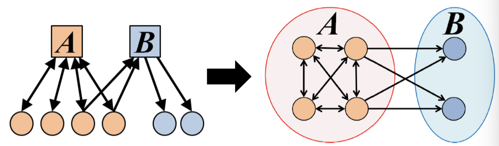


#### Directed AGM

- **Everything is almost the same except now we have 2 matrices:** 𝑭 and 𝑯

  - 𝑭**...** out-going community memberships
  - 𝑯**...** in-coming community memberships

- Edge probability: $P(u,v) = 1 - \exp(-F_u H_v^T)$

- Network log-likelihood:
  $$
  l(F,H) = \sum_{(u,v)\in E}{\log{(1 - \exp(-F_u H_v^T))}} - \sum_{(u,v)\notin E}{F_u H_v^T}
  $$


## Week11-Social Networks 2


## Week11-Clustering

__High dimensional data:__

- Given a cloud of data points we want to understand its **structure**
- Group points into **“clusters”** according to some**distance measure**


__Problem of Clustering:__

- Given a **set of points** that belong to some **space**, with a notion of **distance** between points
- **Group the points** into some number of ***clusters***, so that:
  - Members of **a cluster** are **close/similar** to each other
  - Members of **different clusters** are **dissimilar**
- Usually:
  - Points are in a high-dimensional space
  - Similarity is defined using a **distance measure**


__Difficulties in clustering?__

- High dimensional spaces is difficult
  - __Curse of dimensionality:__ In high dimensions, almost all pairs of points are **equally far away** from one another; almost any **two vectors are orthogonal**.


__Clustering Methods:__

- Hierarchical clustering
  - Attach datapoints to root points
- K-Means clustering
  - Centroid-based
- Density-based methods
  - Clusters contain a minimal number of datapoints


__Clustering algorithms:__

- __Hierarchical clustering__
  - centroid
  - clustroid
  - dendrogam
- __Point assignment__
  - K-means: cluster centers, centroids
  - BFR: extend k-means to handle large data set
  - CURE


### Hierarchical Clustering

Overview:

- **Agglomerative** (bottom up):
  - Initially, each point is a cluster
  - Repeatedly combine the two “nearest” clusters into one
- __Divisive__ (top down):
  - Start with one cluster and recursively split it


#### Agglomerative

__Key operation:__ Repeatedly combine two nearest clusters

__Three key questions:__

- How do you represent a **cluster of more than one** point?

  **Euclidean case:** each cluster has a ***centroid*** **= average of its (data) points**

- How do you determine the **“nearness”** of clusters?

  - Measure cluster distances by distances of centroids

- When to **stop combining** clusters?


__Merging rule:__

- the distance between two clusters is distance between their centroids
- $dist(C1,C2)=$distance of their centroids
- $C1:\{(1,2), (2,2)\}$
  - Centroid = $(1.5, 2)$
- merge two clusters at shortest distance


##### When to stop clustering process?

1. **May know how many clusters** there are in the data
   - Have been told or some **intuitive number of clusters**
2. Stop combining **when best combination** of existing clusters produces a cluster that is inadequate
   - Average distance between centroid and its points should be below some limit


**Rules for Controlling Hierarchical Clustering: Picking Clusters to Merge**

1. Find pair with **smallest distance between centroids** (previous)
2. Take distance between two clusters **as minimum of distances between any two points, one chosen from each cluster**
   - Merge two clusters with minimum distance
   - May result in entirely different clustering from distance-of-centroids
3. Take distance between two clusters to be **average distance of all pairs of points, one from each cluster**
   - Merge two clusters with smallest average distance
4. **Radius of cluster** **= maximum distance between all points and the centroid**
   - Combine two clusters whose resulting cluster has lowest radius
5. **Diameter of cluster =** **maximum distance between any two points of the cluster**
   - Merge the clusters whose resulting clusters has the smallest diameter


##### Non-Euclidean Case

The only “locations” we can talk about are the points themselves: no “average” of two points.


1. **How to represent a cluster of many points?**

   - ***clustroid*** = (data)point “***closest***” to other points

   - Possible meaning of "closest":

     - **Smallest maximum distance** to other points

     - **Smallest average distance** to other points in the cluster

     - **Smallest sum of squares of distances** to other points

       - For distance metric ***d*** clustroid ***c*** of cluster ***C*** is
         $$
         \min_c{\sum_{x\in C}{d(x,c)^2}}
         $$

2. **How do you determine the “nearness” of clusters?**

   - Treat clustroid as if it were centroid, when computing inter-cluster distances
   - Approach1: **Intercluster distance** = minimum of the distances between any two points, one from each cluster
   - Approach2: Pick a notion of “**cohesion**” of clusters, *e.g.*, maximum distance from the **clustroid**
     - Merge clusters whose *union* is most cohesive

3. __When to stop merging?__

   - Approach1: Pick a number **k** upfront, and stop when we have **k** clusters
     - Makes sense when we know that the data naturally falls into k classes
   - Approach2: Stop when the next merge would create a cluster with low “cohesion”


__Cohesion:__

- **Merge clusters whose** ***union*** **is most cohesive**
- Approach 3.1: **Diameter** of the merged cluster = maximum distance between points in the cluster
- Approach 3.2: **Radius**= maximum distance of a point from **centroid** (or clustroid)
- Approach 3.3: Use a **density-based approach**
  - Density = number of points per unit volume
  - divide number of points in cluster by **diameter or radius of the cluster**
  - Perhaps use a power of the radius (e.g., square or cube)


#### Complexity of Hierarchical Clustering

- $n$ data points
- at most $n-1$ step of merging
- Naive implementation, e.g., storing pairwise cluster distances in a matrix


#### Implementation

- **Naïve implementation of hierarchical clustering:**
  - At each step, compute pairwise distances between all pairs of clusters, then merge
    - Initially, $O(n^2)$ for creating matrix and finding pair with minimum distance
    - Subsequent merge $\to$ overall complexity: $O(n^3)$
- Careful implementation using **priority queue** can reduce time to $O(N^2 \log{N})$
  - Still too expensive for big datasets that don't fit in memory


### K-Means Clustering

K-means clustering is centroid-based.


## Week 11 - Social networks 2: Clustering 

__Divisive (top down):__ Start with one cluster and recursively split it.

__Betweenness Concept:__

- <u>Edge betweenness:</u> Number of shortest paths passing over the edge
- Find edges in a social network graph that are least likely to be inside a community
- Betweenness of edge (a, b):
  - number of pairs of nodes $x$ and $y \to x$, $x,y \in C$
  - **edge (a,b) lies on the shortest path between x and y**
- If there are several shortest paths between x and y, edge (a,b) is credited with the fraction of those shortest paths that include edge (a,b)
- **A high score is bad:** suggests that edge (a,b) runs between two different communities
  - a and b are in different communities


<u>How to compute betweenness?</u>

<u>How to select the number of clusters?</u>


### Girvan-Newman Algorithm

- Want to **discover communities using divisive hierarchical clustering**
  - Start with one cluster (the social network) and recursively split it
- **Will do this** based on the notion of edge **betweenness**:
  - **Number of shortest paths passing through the edge**
- **Girvan-Newman Algorithm:**
  - Visits each node X once
  - Computes the number of shortest paths from X to each of the other nodes that go through each of the edges
- __Repeat:__
  - Calculate betweenness of edges
    1. **Thresholding** to remove high betweeness edges, or
    2. **Remove edges** with highest betweenness: **between** communities
- **Connected components are communities**
- Gives a hierarchical decomposition of the network


#### Using Betweenness to Find Communities: Clustering

- **Betweenness scores for edges of a graph behave something like a distance metric**

  - Not a true distance metric

- **Could cluster by taking edges in increasing order of betweenness and adding to graph one at a time**

  - At each step, connected components of graph form clusters

- **Girvan-Newman: Start with the graph and all its edges and**

  **remove edges with highest betweenness**

  - **Continue until graph has broken into suitable number of connected components**
  - **Divisive hierarchical clustering** (top down)
    - Start with one cluster (the social network) and recursively split it.


#### Run Girvan-Newman Iteratively for Community Detection

- **Repeat until no edges are left:**
  - Calculate betweenness of edges
  - This time: remove edges with highest betweenness
- Connected components are communities
- Gives a hierarchical decomposition of the network


### How to select the number of clusters

#### Network Communities

- __Communities:__ sets of tightly connected nodes

- Define: __Modularity $Q$__

  - A measure of how well a network is partitioned into communities

  - Given a partitioning of the network into groups   $s \in S$:
    $$
    Q = \sum_{s\in S}[(\text{# edges within group } s) - (\text{expect # edges within group }s)]
    $$

- $Q(G,S) = \frac{1}{2m} \sum_{s\in S}\sum_{i\in s}\sum_{j\in s}{(A_{ij} - \frac{k_i k_j}{2m})}$, where $A_{ij}=1$ if $i$ connects $j$

- $Q \in [-1,1]$

  - It is positive if the number of edges within groups exceeds the expected number
  - $Q>0.7$  means significant community structure

- __Null Model: configuration model__

  - **Given real** 𝑮 **on** 𝒏 **nodes** **and** 𝒎 **edges**, construct rewired network 𝑮’
    - Same degree distribution but random connections
    - Consider 𝑮’ as a multigraph
    - **The expected number of edges between nodes $i$ and $j$ of degree $k_i$ and $k_j$** equals to: $\frac{k_i k_j}{2m}$
      - The expected number of edges in (multigraph) **G’**: $2m$


<u>Modularity is useful for selecting the number of clusters.</u>


### Spectral Clustering

#### Partitioning Graphs

- Another approach to organizing social networking graphs
- Problem: partitioning a graph to minimize the number of edges that connect different components (communities)
- Goal of minimizing the cut size


**What makes a good partition?**

- Divide nodes into two sets so that the **cut (set of edges that connect nodes in different sets) is minimized**
- Want the two sets to be approximately equal in size
- **Maximize** the number of within-group connections
- **Minimize** the number of between-group connections


**Smallest cut is not necessarily the best cut!!!!!!!!**

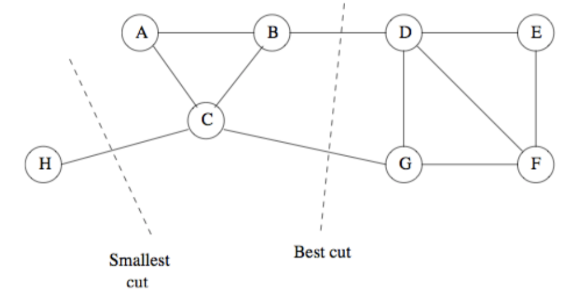


__Graph Cuts:__

- Express partitioning objectives as a function of the “edge cut” of the partition

- **Cut:** Set of edges with only one vertex in a group:
  $$
  cut(A,B)=\sum_{i\in A,j\in B}{w_{ij}}
  $$

- __Criterion 1:__ Minimum-cut

  Minimize weight of connections between groups $\arg\min_{A,B}{cut(A,B)}$

  __Problem:__ 

  - Only considers external cluster connections
  - Does not consider internal cluster connectivity

- __Criterion 2:__ Normalized-cut

  Connectivity between groups relative to the density of each group
  $$
  ncut(A,B)= \frac{cut(A,B)}{vol(A)} + \frac{cut(A,B)}{vol(B)}
  $$
  Where $vol(A)$  is the total number of edges with at least one endpoint in $A$: $vol(A) = \sum_{i\in A}{k_i}$

  <u>This helps to produce more balanced partitions!!!</u>


**How do we efficiently find a good partition?**

- **Problem:** Computing optimal cut is NP-hard


#### Using Matrix Algebra to Find Good Graph Partitions

- Three matrices that describe aspects of a graph:
  - Adjacency Matrix
  - Degree Matrix
  - Laplacian Matrix: difference between degree and adjacency matrix
- Then get a good idea of how to partition graph from eigenvalues and eigenvectors of its Laplacian matrix


$A$: adjacency matrix of undirected  $G$, $A_{ij}=1$  if $(i,j)$  is an edge, else $0$

$D$: degree matrix $D$, $n \times n$ diagonal matrix; $D=[d_{ii}]$, where $d_{ii}=$degree of mode $i$

__Laplacian matrix $L$:__ $n \times n$ symmetric matrix, $L=D-A$

$x$ is a vector in $\mathbb{R}^n$ with components $(x_1,\ldots,x_n)$, think of it as a label/value of each node of $G$.

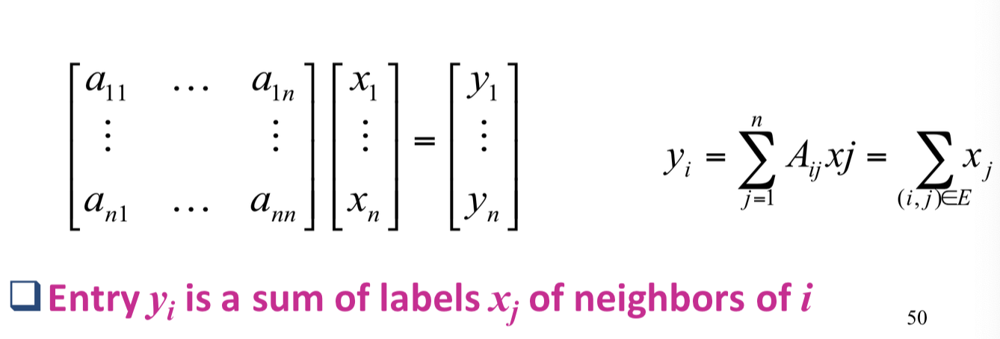


__What is the meaning of $Ax$?__

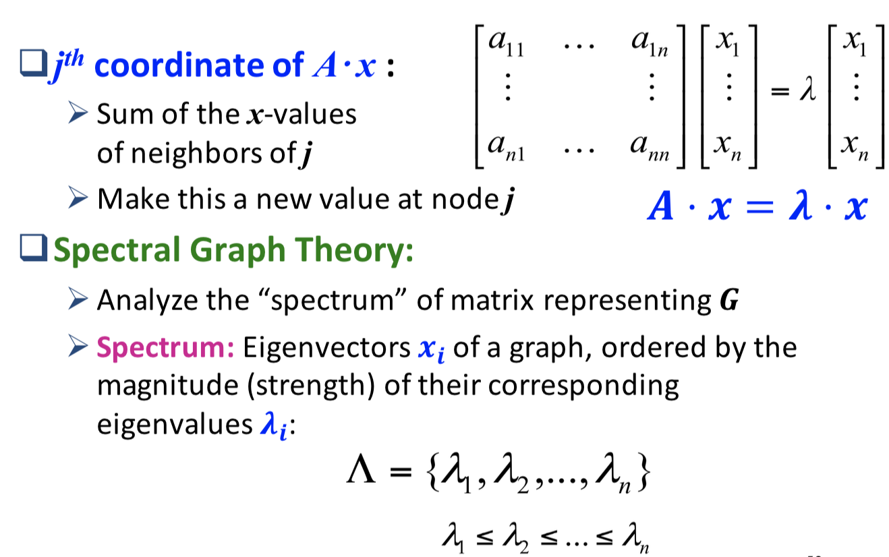

**Important properties of symmetric matrices:**

- Eigenvalues are non-negative real numbers: 

- **Eigenvectors** are real and orthogonal
- $\bf{x}^T \bf{1} = \sum_{i=1}^n x_i = 0$


- **Smallest eigenvalue** for every Laplacian matrix is **0**

- Its corresponding eigenvector is  $[1,1,1,...1]$

- To find **second-smallest eigenvalue** for symmetric matrix (such as Lapalcian)

- Value of $x$ that achieves this minimum is the **second eigenvector**

- This second smallest eigenvector x will have some positive and some negative components 

- **Partition the graph by taking one set to be the nodes I whose corresponding vector component xi is positive**

- **What is the meaning of $\min x^T L x$ on $G$?**
  $$
  \bf{x}^T L \bf{x} = \sum_{(i,j)\in E}{(x_i - x_j)^2}
  $$
  


## Week 12 - Link Analysis

__Problem:__

- Web as a directed graph

  - Nodes: Webpages

  - Edges: Hyperlinks

  - Early web search:

    - <u>Keywords extracted from web pages:</u> Use title and content to build __inverted index__

    - <u>Queries are matched with web pages:</u> Via lookup in the inverted index; pages rank by __occurrences of query keywords__

    - > __Problem:__ susceptible to __term spam__


__Challenges of web search:__

1. Web contains many sources of information
2. What is the “best” answer to query “newspaper”?


We will cover the following **Link Analysis approaches** for computing **importance** of nodes in a graph:

- Page Rank
- Topic-Specific (Personalized) Page Rank
- Web Spam Detection Algorithms


### PageRank: the "Flow" Formulation

Calculate the probability that a random surfer lands on the page.

Random surfer model more robust than manual approach: <u>A collective voting scheme</u>.


__Graph:__

- Nodes = pages
- Edges = hyperlinks between pages


__Extreme Case:__

- <u>Dead end:</u> a page with no edges out
  - Absorb PageRanks
  - PageRank $\to$ 0 for any page that can reach the dead end (including the dead end itself)
- <u>Spider Trap:</u> Group of pages with no edges going out of group
  - Absorb all PageRanks
  - Surfer can never leave, once trapped
  - Can have $>1$  nodes


#### Formulation Details

- Links as votes: 
  - page is more important if it has more links
  - Links from important pages count more
  - Recursive question:
    - Each link's vote is proportional to the importance of its source page
    - If page  $j$  with importance  $r_j$  has  $n$  out-links, each link gets  $r_j / n$  votes
    - Page  $j$'s own importance is the sum of the votes on its in-links: $r_j = r_i/3 + r_k/4$


__The "flow" model:__

- A "vote" from an important page is worth more

- A page is important if it is pointed to by other important pages

- Define a "rank"  $r_j$  for page  $j$:
  $$
  r_j = \sum_{i \to j}{\frac{r_i}{d_i}}
  $$
  where  $d_i$ is the out-degree of node  $i$


#### Matrix Formulation

- Stochastic Transition (or adjacency) Matrix  $M$
- Suppose page  $j$  has  $n$  outlinks
  - If outlink  $j \to i$, then  $M_{ij} = 1/n$
  - Else  $M_{ij} = 0$  
- $M$  is a column stochastic matrix
  - Columns sum to 1
- $M_{i,j} = $ Prob of going from node  $j$  to node  $i$
  - if  $j$  has  $k$  out-going edges, prob for each edge  = $1/k$
- Rank vector  $\bf{r}$  is a vector with one entry per web page
  -  $r_i$  is the importance score of page  $i$
- the flow equations can be writtern as  $\bf{r} = M \bf{r}$, which can be solved using __Power Iteration__ or __the principal eigenvector__


#### Stationary Distribution

- Limiting prob. distribution of random surfer
  - PageRanks are based on limiting distribution
  - the probability destruction will converge eventually
- Requirement for its existence
  - Graph is strongly connected: a node can reach any other node in the graph
  - Cannot have dead ends, spider traps


#### Power Iteration

- Simple iterative scheme (relaxation)

- suppose there are  $N$  web pages

- Initialize: $r^0 = [1/N, \ldots, 1/N]^T$

- Iterate: $\bf{r}^{k+1} = M \bf{r}^k$
  $$
  \bf{r}_j^{(t+1)} = \sum_{i\to j}{\frac{r_i^{(t)}}{d_i}}
  $$

- Stop when  $|\bf{r}^{k+1} - \bf{r}^k|_1 < \epsilon$


#### Problems of PageRank

1. Some pages are __dead ends__
   - Random walk has “nowhere” to go to
   - Such pages cause importance to “leak out”
2. __Spider traps__
   - Random walked gets "stuck" in a trap
   - And eventually spider traps absorb all importance


#### Solution for spider trap: Teleports

- The Google solution for spider traps: At each time step, the random surfer has two options
  - with prob $\beta$ follow a link at random
  - with prob  $1-\beta$  jump to sum random page
  - common value for $\beta$ are in the range  $0.8$  to  $0.9$
- Surfer sill teleport out of spider trap within a few time steps
- $\bf{r}^{k+1} = 0.8M \bf{r}^k + 0.2 Q \bf{r}^k$, where $\bf{Q}$ is a matrix each element of which is $1/N$, assuming there are $N$ nodes in the graph
- For dead end problem modify the column for dead end node to be all $1/N$


## Week13 - Mining Data Streams

### Basic Concept

__Data stream:__

1. the entire set of data is unknown in advance
2. Stream management is important when the inpu is controlled externally
3. the data is infinite and non-stationary (the distribution changes over time)


__the Stream Model:__

1. Input elements enter at a rapid rate, at one or more input ports
   - we cake elements of the stream tuples: __(user, query, time)__
2. the system cannot store the entire stream accessibly


__Stream data and Data Base Management system:__

- Stream of tuples arriving at a rapid rate
  - in contrast to traditional DBMS where all tuples are stored in secondary storage
- Infeasible to use all tuples to answer queries
  - Cannot __store__ them all in main memory
  - too much __computation__
  - query __response time__ critical


__Forms of Query:__

1. __Standing queries:__
   - Executed whenever a new tuple arrives
   - e.g., report each new maximum value ever seen in the stream
2. __Ad-hoc queries:__
   - Normal queries asked one time about streams
   - e.g., what is the maximum value so far?


> __Example:__ Running averages
>
> Given a window of size $N$
>
> - Report the average of values in the window whenever a value arrives
> - $N$ is so large that we cannot store all tuples in the window
>
> 
>
> Solution:
>
> - first $N$ inputs, accumulated sum and count: $Avg = sum/count$
> - a new element $i$
>   - Change the average by adding  $(i-j)/N$
>   - $j$  is the oldest element in the window


#### Problems on Data Streams

- Types of queries one wants on answer on a data stream
  - Queries over sliding windows
  - Sampling data from a stream
  - Filtering a data stream
  - Counting distinct elements
  - Estimating moments
  - Finding frequent elements


#### Applications

- Mining query streams
- Mining click streams
- Mining social network news feeds


#### Sliding Windows

- A useful model of stream processing is that queries are about a ***window*** of length ***N*** – the ***N*** **most recent elements received**
- __Interesting case:__ $N$ is so large that the data cannot be stored in memory, or even on disk
  - Or, there are so many streams that windows for all cannot be stored


### Counting Bits

#### Problem

- Given a stream of 0s and 1s
- Be prepared to answer queries of the form "how many1s are in the last _k_ bits?" Where  $k\le N$


__Obvious solution:__ Store the most recent $N$ bits

- When new bit comes in, discard the $N+1^{st}$ bit
- But answering the query will take  $O(k)$  time
  - Possibly too much time
- the space requirements can be too great
  - Especially if there are many streams to be managed in <u>main memory at once</u>, or  $N$  is huge


__We are happy with an approximate answer.__

#### Simple Solution

Maintain 2 counters:

- $S$: number of 1s from the beginning of the stream
- $Z$: number of 0s from the beginning of the stream
- Then there are $N \cdot \frac{S}{S+Z}$
- <u>what if distribution changes over time????</u>


#### DGIM Method

__Advantage:__

- Store  $O(\log^2{N})$  bits per stream
  - $O(\log{N})$  counts of  $\log_2{N}$  bits each
- Does not assume uniformity
- Esay update as more bits enter
- Error in count no greater than the number of 1s in the "unknown" area


__Disadvantage:__

- As long as the **1s** are fairly evenly distributed, the error due to the unknown region is small – **no more than 50%**
- But it could be that **all the 1s are in the unknown area** at the end. In that case, the error is unbounded


##### Fixup

- **Idea:** Instead of summarizing fixed-length blocks, summarize blocks with specific number of **1s**:
  - Let the block __sizes__ (number of 1s) increase exponentially
- **When there are few 1s in the window, block sizes stay small, so errors are small**


##### Timestamps

- Each bit in the stream has a ***timestamp***, starting 1,2, ...
- Record timestamps modulo N (the window size), so we can represent any relevant timestamp in  $O(\log_2{N})$  bits
- Store  $O(\log^2{N})$ bits per stream 


##### Buckets

A ***bucket*** in the DGIM method is a record consisting of:

- the timestamp of its end: $O(\log{N})$  bits
- the number of 1s between its beginning and end: $O(\log{\log{N}})$  bits
  - number of 1's = size of the bucket


Constraint on buckets: number of 1's must be a power of 2:

- this explains the $O(\log{\log{N}})$


##### Representing a Stream by Buckets

- Either **one** or **two** buckets with the same **power-of-2 number** of **1s**
- Buckets do not overlap in timestamps
- Buckets are sorted by size
  - Earlier buckets are not smaller than later buckets
- Buckets disappear when their end-time is > N time units in the past


##### Updating Buckets

- When a **new bit comes in**, **drop the last (oldest) bucket** if its **end-time is prior to** ***N***time units before the current time
- if the current bit is 0: no other changes are needed
- if the current bit is 1:
  1. create a new bucket of size 1, for just this bit: end timestamp = current time
  2. if there are now three buckets of size 1, combine the oldest two into a bucket of size 2
  3. if there are now three buckets of soze 2, combine the oldest two into a bucket into a bucket of size 4
  4. and so on ...


##### How to Query?

- to estimate the number of 1's in the most recent  $k \le N$  bits:

  1. Restrict your attention to only those buckets whose end time stamp is at most  $k$  bits in past
  2. Sum the sizes of all these buckets but the oldest
  3. Add half the size of the oldest bucket

  > __Remember:__ We do not know how many **1s**of the last bucket are still within the wanted window.


##### Error Bound

- suppose the last bucket has size $2^i$
- Then by assuming  $2^{i-1}$  of its 1's are still within the window, we make an error of at most  $2^{i-1}$
- Since there is at least one bucket of each of the sizes less than  $2^i$, and at least 1 from the oldest bucket, the true sum is no less than  $2^i$: $2^{i-1} + 2^{i-2} + \cdots + 2^1 + 2^0 = 2^i - 1$
- thus the error at most  $50\%$


#### Further Reducing the Error

- Instead of maintaining **1** or **2** of each size bucket, we ($i> 2$) **allow either $i-1$ or $i$ buckets**
  - Except for the largest size buckets; we can have any number between **1** and  $i$  of those
- Error is at most  $O(1/i)$
- by picking  $i$  appropriately, we can tradeoff between number of bits we store and the error


### Bloom Filters

__Problem:__ Given a stream of URLs, filter out those URLs who have been seen before and append the unseen URL to the list for later web crawler.

__Obvious solution:__ hash table

- if we don't have enough memory to store all of  $S$  in a hash table


#### Applications

- __Email spam filtering:__ we know 1 billion "good" email addresses; if an email comes rom one of these, it is NOT spam
- __Publish-suscribe systems:__ you are collecting lots of messages (news articles); people express interest in certain sets of keywords; determined whether each message matches user's interest


#### Role of the Bloom Filter

- A Bloom filter placed on the stream of URL’s will declare that **certain URL’s have been seen before**
- Others will be declared new, and will be added to the list of URL's that need to be crawled
- Unfortunately, the Bloom can have __false positives__
  - it can declare a URL has been seen before when it hasn't
  - but if it says "never seen", then it is truly new (no false negative)


#### How a Bloom Filter Works

- A ***Bloom filter*** is an array of bits, together with a number of **hash functions**
- The argument of each hash function is a**stream element**, and it returns a **position** in the array
- Initially, all bits are 0
- When input  $x$  arrives, we set to 1 the bits  $h(x)$  for each hash function  $h$

__Example:__

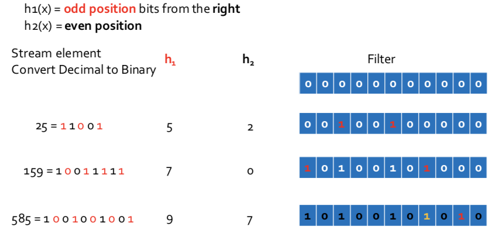

#### Bloom Filter Lookup

- Suppose element **y appears** in the stream, and we want to know **if we have seen y before**
- **Compute h(y)** for each hash function y
- If all the resulting **bit positions are 1**, say we have **seen y before** **(false positive)**
- If at least one of these **positions is 0**, say we have **not seen y before** **(true negative)**


#### Performance of Bloom Filters

- Probability of a false positive depends on the density of 1's in the array and the number of hash functions: $=(\text{fraction of 1's})^{\text{# of hash functions}}$
- $\text{# of 1’s} \approx \text{# of elements inserted} \times \text{# of hash functions}$
  - but collisions lower that number slightly


##### Throwing Darts

We have  $d$  darts, $t$  targets. 

- Probability a given target is hit by a given dart $=1/t$
- Probability non of  $d$  darts hit a given target is $= (1-1/t)^d$
- Probability that a target gets at least one dart $=1-(1-1/t)^{d}$
  - when  $t$  is large enough, $1-(1-1/t)^{d} = 1-(1-1/t)^{t\cdot d/t} \approx 1 - e^{-d/t}$
- where  $d = \text{# of bits}$,  $t = \text{# of hash functions} \times \text{# of inserted elements}$


> __Example__
>
> Suppose we use an array of 1 billion bits**, **5 hash functions, and we insert 100 million elements.
>
> - $t = 10^9$,  $d=5\times 10^8$
> - the fraction of 0's that remain will be  $e^{1/2} = 0.607$
> - density of 1's $= 1 - 0.607 = 0.393$
> - Probability of a false positive $= (0.393)^5 = 0.00937$ 


### Sampling Streams

Since **we can not store the entire stream**, one obvious approach is to store a **sample**.

Two different problems:

1. Sample a fixed proportion of elements in the stream
2. maintain a random sample of fixed size over a potentially infinite stream


#### Sampling a fixed proportionScenario: Search engine query stream

__Scenario:__

- Stream of tuples: (user, query, time)
- have space to store 1/10 of query stream


__Naive solution:__

- Generate a **random integer** in **[0..9]** for each query
- Store the query if the integer is **0**, otherwise discard


__Example:__ Unique search queries


__Problem with naive approach:__ we sampled based on the **position**in the stream, rather than **the value of the stream element**


__Solution:__

1. Pick **1/10** of **users** and take all their searches in the sample
2. Use a hash function that hashes theuser name or user id uniformly into 10 buckets.


__Generalized Solution:__

- Stream of tuples with keys:
  - Key is some subset of each tuple’s components
    - e.g., tuple is (user, search, time); key is **user**
  - Choice of key depends on application
- To get a sample of  a/b  fraction of the stream:
  - Hash each tuple’s key uniformly into ***b*** buckets
  - Pick the tuple if its hash value is at most ***a***


#### Sampling a fixed- size sample

As the stream grows, the sample is of fixed size.

If we fix the proportion of sample from the stream, as the stream grows, the 10% sample will also be  too big.

__Idea:__ throw away some queries.

__Key:__ do this consistently

- remove all or none of occurrences of a query


Put an upper bound on the sample size:

- Start out with $10\%$
- Hash queries to a large # of buckets, say 100
  - Take for the sample those elements hashing to buckets 0 through 9
- When sample grows too big, throw away bucket 9
- Still too big, get rid of 8, and so on


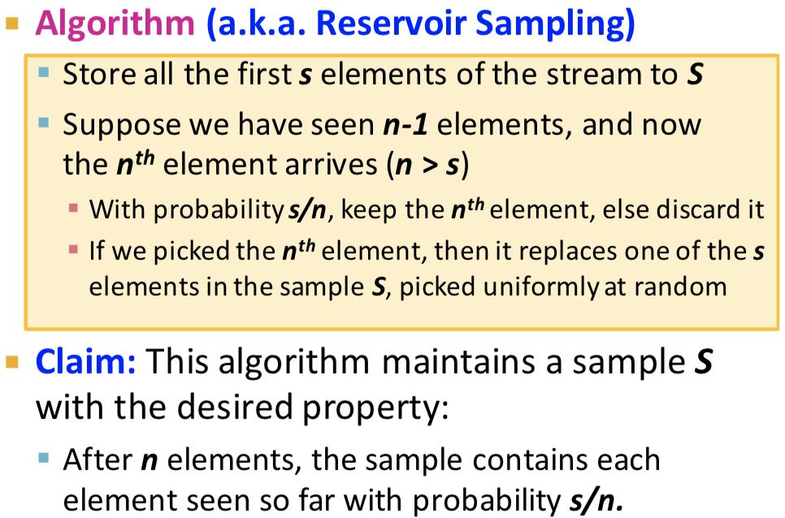


### Counting Distinct Element: Flajolet-Martin

#### Problem

- Data stream consists of a **universe of elements** chosen from a set of size ***N***
- Maintain a count of the number of distinct elements seen so far


__Obvious approach:__

Maintain the set of elements seen so far.

- That is, keep a **hash table** of all the distinct elements seen so far.


**Estimate the count in an unbiased way.**

**Accept that the count may have a little error, but limit the probability that the error is large.**


#### Flajolet-Martin algorithm

Estimating the counts

- Pick a hash function  $h$  that maps each of the  $n$  elements to at least  $\log_2{n}$  bits
- For each stream element  $a$, let  $r(a)$  be the number of trailing 0's in  $h(a)$
- Maintain  $R=$ the maximum  $r(a)$ (e.g., $R=2$)
- Estimate = $2^R$


##### why it works? Intuition

-  $h(a)$  hashes  $a$  with equal prob to any of  $N$  values
- Then  $h(a)$  is a sequence of  $\log_2{N}$  bits
- the probability that a given  $h(a)$  ends in at least  $i$  0's is  $2^{-i}$
- if there are  $m$  different elements, the probability that  $R \ge i$  is  $1 - (1-2^{-i})^m$
- since  $2^{-i}$  is small,  $1-(1-2^{-i})^m = (1-2^{-i})^{2^i (m 2^{-i})} \approx 1 - e^{-m 2^{-i}} = 1 - e^{-\frac{m}{2^i}}$ 
  - if  $2^i \gg m$, $p = 1 -  e^{-\frac{m}{2^i}} \approx 1 - (1 - \frac{m}{2^i}) = \frac{m}{2^{i}} \approx 0$
  - if  $2^i \ll m$, $p = 1 - 1/e^{\frac{m}{2^i}} \to 1$

**Thus, $2^i$ will almost always be around** $m$.


##### Why it doesn't work

- $E(2^R)$  is infinite
- Workaround involves using **many hash functions** $h_i$ and getting **many samples of** $R_i$
- How to combine samples  $R_i$?
- **Average?** What if one very large value $2^{R_i}$ ?
- **Median?** All estimates are a power of 2


##### Solution

- Partition your samples into small groups
  - $\log{n}$, where n=size of universal set, suffices
- Take the average of groups
- Then take the median of the averages
- the result is the unbiased estimate


### Estimating Moments: AMS method


### Summary

- DBMS vs Stream Management
- Stream data processing and type of queries
- Counting the number of 1s in the last  $N$  elements
  - Exponentially increasing windows
  - Extensions:
    - Number of 1s in any last  $k$  elements $(k < N)$
    - Sums of integers in the last  $N$  elements
- Sampling data from a stream
  - Method 1: sample a fixed portion of elements
  - Method 2: maintain a fixed-size sample
- Filtering a data stream: Bloom filters