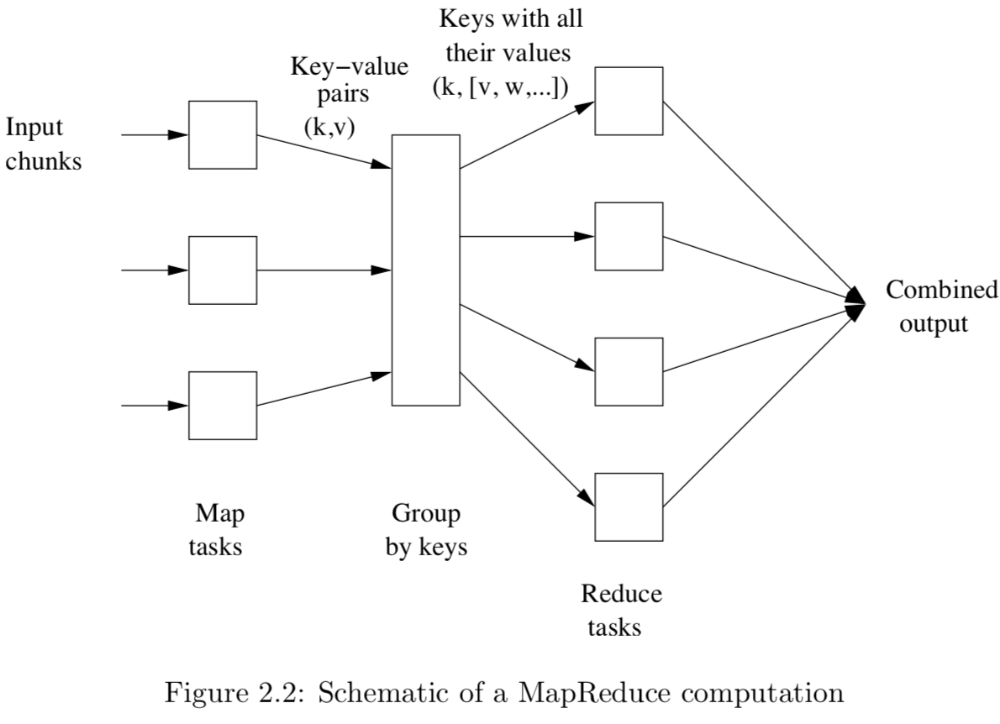

# Mining Massive Dataset - Notes

[TOC]

## Chapter 2: MapReduce and the New Software Stack

### 2.1 Distributed File Systems

#### 2.1.1 Physical Organization of Compute Nodes

__Clustering Computing:__

- the new parallel-computing architecture
- Compute nodes are stored on racks, perhaps 8–64 on a rack.
  - nodes on a single rack are connected by a network, typically gigabit Ethernet
- racks are connected by another level of network or a switch
- the bandwidth of inter-rack communication is greater than the intrarack Ethernet
- principle failure modes:
  - the loss of a single node (e.g., the disk at that node crashes)
  - the loss of an entire rack (e.g., the network connecting its nodes to each other and to the outside world fails)

__How to solve the problem of component failure in the clustering computing?__

1. Files must be stored redundantly.
2. Computations must be divided into tasks, such that if any one task fails to execute to completion, it can be restarted without affecting other tasks.

#### 2.1.2 Large-Scale File-System Organization

To solve the problems mentioned above, we have __distributed file system (DFS)__.

> __DFS Implementations__
>
> 1. $Google$ $File$ $System$ (GFS), the original of the class.
> 2. $Hadoop$ $Distributed$ $File$ $System$ (HDFS), an open-source DFS used with Hadoop, an implementation of MapReduce.
> 3. $CloudStore$, an open-source DFS originally developed by Kosmix.

In DFS:

- Files can be enormous, possibly a terabyte in size. If you have only small files, there is no point using a DFS for them.
- Files are rarely updated.
- Files are divided into __chunks__, which are typically __64 MB__ in size:
  - chunks are replicated
  - the nodes holding copies of one chunk should be located on different racks
  - both the chunk size and the degree of replication can be decided by the user
- Use __master node (name node)__ to find the chunks of a file
  - the master node is itself replicated, and a directory for the file system as a whole knows where to find its copies
  - the directory itself can be replicated, and all participants using the DFS know where the directory copies are.

### 2.2 MapReduce

In MapReduce, customer need to write __Map__ function and __Reduce__ function, while the system manages the parallel execution, coordination of tasks that execute Map or Reduce, and also deals with possibility that one of these tasks will fail to execute.

A MapReduce computation executes as follows:

1. Some number of Map tasks each are given one or more chunks from a distributed file system. These Map tasks turn the chunk into a sequence of key-value pairs. The way key-value pairs are produced from the input data is determined by the code written by the user for the Map function.
2. The key-value pairs from each Map task are collected by a __master controller__ and sorted by key. The keys are divided among all the Reduce tasks, so all key-value pairs with the same key wind up at the same Reduce task.
3. The Reduce tasks work on one key at a time, and combine all the val- ues associated with that key in some way. The manner of combination of values is determined by the code written by the user for the Reduce function.

The __Map__ function emits key-value pairs like ``(k,v)``, the __Reduce__ function receive keys with all their values like ``(k, [v,w,...])``.

#### 2.2.1 The Map Tasks

- __input files:__ consisting of elements, which can be any type: a tuple or a document.
- takes an input element as its argument
- produces zero or more key-value pairs
- __Key:__ a Map task can produce several key-value pairs with the same key, even from the same element

#### 2.2.2 Grouping by Key

The grouping is performed by the system. The master controller process knows how many Reduce tasks there will be, say $r$ such tasks. The master controller picks a hash function that applies to keys and produces a bucket number from $0$ to $r − 1$. Each key that is output by a Map task is hashed and its key-value pair is put in one of $r$ local files.

For each key $k$, the input to the Reduce task that handles key $k$ is a pair of the form $(k, [v_1, v_2, \ldots , v_n])$, where $(k,v_1)$, $(k,v_2)$,...,$(k,v_n)$ are all the key-value pairs with key $k$ coming from all the Map tasks.

#### 2.2.3 The Reduce Tasks

- __Input (argument):__ a pair consisting of a key and its list of associated values
- __Output:__ a sequence of zero or more key-value pairs
- a Reduce task receives one or more keys and their associated value lists (a Reduce task executes one or more reducers)
- The outputs from all the Reduce tasks are merged into a single file

#### 2.2.4 Combiners

Sometimes, a Reduce function is associative and commutative. That is, the values to be combined can be combined in any order, with the same result.

When the Reduce function is associative and commutative, we can push some of what the reducers do to the Map tasks.

__How to sove the problem of "skew"?__

- Use fewer Reduce tasks than there are reducers
- Use more Reduce tasks than there are compute nodes

##### 2.2.5 Details of MapReduce Execution

1. the user program forks a Master controller process and some number of Worker processes at different compute nodes.
   - a Worker handles either Map tasks (a Map worker) or Reduce tasks (a Reduce worker), but not both.
   - responsibilities of the master:
     - create some number of Map tasks and some number of Reduce tasks, these numbers being selected by the user program
     - assign these tasks to Worker processes
     - need to limit the number of Reduce tasks, since it is necessary for each Map task to create an intermediate file for each Reduce task, and if there are too many Reduce tasks the number of intermediate files explodes.
     - keeps track of the status of each Map and Reduce task (idle, executing at a particular Worker, or completed)
2. a Worker process reports to the Master when it finishes a task
3. a new task is scheduled by the Master for that Worker process
4. The Map task creates a file for each Reduce task on the local disk of the Worker that executes the Map task.
5. When a Reduce task is assigned by the Master to a Worker process, that task is given all the files that form its input.
6. The Reduce task executes code written by the user and writes its output to a file that is part of the surrounding distributed file system.

- Each Map task is assigned one or more chunks of the input file(s) and executes on it the code written by the user.

#### 2.2.6 Coping With Node Failures

__Worst case:__ the compute node at which the Master is executing fails, then the entire MapReduce job must be restarted <u>(other failures will be managed by the Master)</u>.

__Map worker failures:__ 

- the failure will be detected by the Master, because it periodically pings the Worker processes.
- All the Map tasks that were assigned to this Worker will have to be redone, even if they had completed
  - these Map tasks' output destined for the Reduce tasks resides at that compute node, and is now unavailable to the Reduce tasks.
- The Master sets the status of each of these Map tasks to idle, and will schedule them on a Worker when one becomes available. 
- The Master must also inform each Reduce task that the location of its input from that Map task has changed.

__Reduce worker failures:__

- The Master simply sets the status of its currently executing Reduce tasks to idle.
- These Reduce tasks will be rescheduled on another reduce worker later.

### 2.3 Algorithms Using MapReduce

