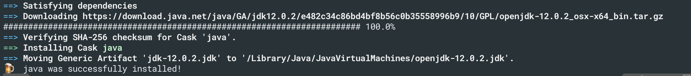

# INF-553

INF-553 2019 fall, by Prof. Anna Farzindar

[TOC]

## Basic Course Information


- Lec1: Introduction & MapReduce1


## Homework

__Environment:__ macOS Mojave 10.14.5

__Requirements:__ Python 3.6, Scala 2.11 and Spark 2.3.3

> Except the requirements above, you can only use standard python libraries


### Install

Before installing, make sure you have [Anaconda](https://www.anaconda.com/distribution/) as well as [Homebrew](https://brew.sh/).

#### Install Java JDK

Here, I use ``brew`` to install Java JDK, in terminal:

```bash
brew cask install java
```

When finished, you can see the download location, mine is



that is, ``/Library/Java/JavaVirtualMachines/openjdk-12.0.2.jdk``.

Then add the ``JAVA_HOME`` in ``.zshrc`` file (if using bash, just add this to ``.bash_profile`` file):

```bash
export JAVA_HOME="/Library/Java/JavaVirtualMachines/openjdk-12.0.2.jdk/Contents/Home"
```

save the changes and activate the change in the terminal:

```bash
source ~/.zshrc
```

or for bash:

```bash
source ~/.bash_profile
```

Some other installment tutorial suggests to set ``JAVA_HOME`` as ``usr/lib/jvm/xxx.jdk``, but this didn't work in my system.

Now check whether you have installed Java JDK successfully in terminl:

```bash
java -version
```

Mine is

#### Install Spark

Open the [download link](https://archive.apache.org/dist/spark/spark-2.3.3/) and choose the version you want. Here I chose ``spark-2.3.3-bin-hadoop2.7.tgz``.


#### Install Pyspark in cond environment

Create new conda environment:

```bash
conda create -n inf553 python=3.6
```

and activate the environment when finished

```bash
conda activate inf553
```

Now install ``Pyspark`` using ``conda``:

```bash
conda install -c conda-forge pyspark
```


### Homework Details

- HW1

