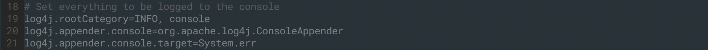

# INF-553

INF-553 2019 fall, by Prof. Anna Farzindar

[TOC]

## Basic Course Information


- Lec1: Introduction & MapReduce1


## Homework

__Environment:__ macOS Mojave 10.14.5

__Requirements:__ Python 3.6, Scala 2.11 and Spark 2.3.3

> Except the requirements above, you can only use standard python libraries


### Install

Before installing, make sure you have [Anaconda](https://www.anaconda.com/distribution/) as well as [Homebrew](https://brew.sh/).

#### Install Java JDK

Download Java JDK from the [link](https://www.oracle.com/technetwork/java/javase/downloads/jdk8-downloads-2133151.html), and open the ``dmg`` file to install it.

Then add the ``JAVA_HOME`` in ``~/.zshrc`` file (if using bash, just add this to ``~/.bash_profile`` file):

```bash
export JAVA_HOME="/Library/Java/JavaVirtualMachines/jdk1.8.0_221.jdk/Contents/Home"
```

save the changes and activate the change in the terminal:

```bash
source ~/.zshrc
```

or for bash:

```bash
source ~/.bash_profile
```

Some other installment tutorial suggests to set ``JAVA_HOME`` as ``usr/lib/jvm/xxx.jdk``, but this didn't work in my system.

Now check whether you have installed Java JDK successfully in terminl:

```bash
java -version
```

Mine is


> I used to try to install Java via ``brew``:
>
> ```bash
> brew cask install java
> ```
>
> which install Java 12. __However__, it seemed there's some problem with Java 12 and Spark 2.3.3, so I finally used Java 8 JDK ([this problem was mentioned here](https://towardsdatascience.com/how-to-get-started-with-pyspark-1adc142456ec)).


#### Install Spark

Open the [download link](https://archive.apache.org/dist/spark/spark-2.3.3/) and choose the version you want. Here I chose ``spark-2.3.3-bin-hadoop2.7.tgz``.

When download finished, unzip it and move it to your ``/opt`` folder:

```bash
tar -xzf spark-2.3.3-bin-hadoop2.7.tgz
mv spark-2.3.3-bin-hadoop2.7 /opt/spark-2.3.3
```

Create a symbolic link (assuming you have multiple spark versions):

```bash
sudo ln -s /opt/spark-2.3.3 /opt/spark
```

Then add Spark path in the ``~/.zshrc`` or ``~/.bash_profile`` file and activate it:

```bash
export SPARK_HOME="/opt/spark"
export PATH="$SPARK_HOME/bin:$PATH"
```

Now, run the example to see whether install successfully:

```bash
cd /opt/spark/bin
# use grep to get clean output result
run-example SparkPi 2>&1 | grep "Pi is"  
```

My result:


#### Install Pyspark in conda environment

Create new conda environment:

```bash
conda create -n inf553 python=3.6
```

and activate the environment when finished

```bash
conda activate inf553
```

Now install ``Pyspark`` using ``pip`` :

```bash
pip install pyspark==2.3.3
```

> I tried to install ``pyspark==2.4.4``, but this could cause incompatibility with Spark JVM libraries since Spark 2.3.3 is used!!! If use ``pyspark==2.4.4``, running test file showed [here](#testfile)  will end with error:
>
> ```python
> Traceback (most recent call last):
>   File "test.py", line 5, in <module>
>     numAs = logData.filter(lambda line: 'a' in line).count()
>   File "//anaconda3/envs/inf553/lib/python3.6/site-packages/pyspark/rdd.py", line 403, in filter
>     return self.mapPartitions(func, True)
>   File "//anaconda3/envs/inf553/lib/python3.6/site-packages/pyspark/rdd.py", line 353, in mapPartitions
>     return self.mapPartitionsWithIndex(func, preservesPartitioning)
>   File "//anaconda3/envs/inf553/lib/python3.6/site-packages/pyspark/rdd.py", line 365, in mapPartitionsWithIndex
>     return PipelinedRDD(self, f, preservesPartitioning)
>   File "//anaconda3/envs/inf553/lib/python3.6/site-packages/pyspark/rdd.py", line 2514, in __init__
>     self.is_barrier = prev._is_barrier() or isFromBarrier
>   File "//anaconda3/envs/inf553/lib/python3.6/site-packages/pyspark/rdd.py", line 2414, in _is_barrier
>     return self._jrdd.rdd().isBarrier()
>   File "//anaconda3/envs/inf553/lib/python3.6/site-packages/py4j/java_gateway.py", line 1257, in __call__
>     answer, self.gateway_client, self.target_id, self.name)
>   File "//anaconda3/envs/inf553/lib/python3.6/site-packages/py4j/protocol.py", line 332, in get_return_value
>     format(target_id, ".", name, value))
> py4j.protocol.Py4JError: An error occurred while calling o23.isBarrier. Trace:
> py4j.Py4JException: Method isBarrier([]) does not exist
>         at py4j.reflection.ReflectionEngine.getMethod(ReflectionEngine.java:318)
>         at py4j.reflection.ReflectionEngine.getMethod(ReflectionEngine.java:326)
>         at py4j.Gateway.invoke(Gateway.java:274)
>         at py4j.commands.AbstractCommand.invokeMethod(AbstractCommand.java:132)
>         at py4j.commands.CallCommand.execute(CallCommand.java:79)
>         at py4j.GatewayConnection.run(GatewayConnection.java:238)
>         at java.lang.Thread.run(Thread.java:748)
> ```

Add these codes to ``~/.zshrc`` or ``~/.bash_profile`` file to enable python/ipython from conda environment to use PySpark:

```bash
export PYSPARK_PYTHON="/anaconda3/envs/inf553/bin/python"
export PYSPARK_DRIVER_PYTHON="/anaconda3/envs/inf553/bin/ipython"
```

Then activate the changes:

```bash
source ~/.zshrc
```

or

```bash
source ~/.bash_profile
```


Now run the <a name="testfile">``test.py``</a> using ``spark-submit test.py``  to see the result. the ``test.py`` is showed below:

```python
# test.py
from pyspark import SparkContext
sc = SparkContext( 'local', 'test')
logFile = "file:///opt/spark/README.md"
logData = sc.textFile(logFile, 2).cache()
numAs = logData.filter(lambda line: 'a' in line).count()
numBs = logData.filter(lambda line: 'b' in line).count()
print('Lines with a: %s, Lines with b: %s' % (numAs, numBs))
```

The running result is

```python
Lines with a: 61, Lines with b: 30
```

> There might be a lot of LOG informations in the print out result when running the ``spark-submit`` as showed:
>
>  We can manage to hide them. 
>
> Go to the spark configure folder:
>
> ```
> cd /opt/spark/conf
> ```
>
> Copy the ``log4j.properties.template`` file and edit the copy:
>
> ```bash
> cp log4j.properties.template log4j.properties
> vim log4j.properties
> ```
>
> Then you can see in the Lin 19, there is ``log4j.rootCategory=INFO, console``:
>
> 
>
> Change ``INFO`` to ``WARN`` and save the file. Then it is done!


#### Install Scala

Download scala 2.11.8 from the [link](https://www.scala-lang.org/download/2.11.8.html), then run:

```bash
sudo tar -zxf scala-2.11.8.tgz -C /usr/local
cd /usr/local/
sudo mv ./scala-2.11.8/ ./scala
```

Add code to ``~/.zshrc`` or ``~/.bash_profile``:

```bash
export PATH="/usr/local/scala/bin:$PATH"
```

Now run Scala in the terminal:

> It seems there will be problem if install Scala 2.11.12.


### Homework Details

- HW1

  - Task 1: use ``user.json``

    

  - Task 2: use ``user.json``

  - Task 3: use ``review.json`` and ``business.json``

  - 

- HW2

  - Task 1: use A-Priori & SON algorithm to find all possible frequent itemsets
    - for ``small2.csv`` case 1 with ``support=4``, local test shows ``minPartition=3``, ``A_priori_short_basket()`` works better. Local test takes 7 seconds. 
    - for ``small1.csv`` case 2 with ``support=9``, local test shows ``minPartition=2``, ``A_priori_long_basket()`` works better. Local test takes 8 seconds. 
    - ``A_priori_long_basket()`` optimizes the process of generating itemset size  $k+1$  from itemset size  $k$
  - Task 2: use ``A_priori_long_basket()``, local test shows ``minPartition=6`` works better. Local test takes around 202 seconds.

- HW3

  - Task1: min-hash & LSH to find similar business_id pars

    - Jaccard similarity: 

      - Use ``mapPartitions()`` instead of ``.map()`` for most ``RDD`` operations to speed up

      - local test shows optimal ``numPartitions=5`` using ``sc.parallelize()`` to load input file (sometimes ``parallelize()`` is not large enough to load input file), with 

        - pure computation time <u>8 seconds</u> for the whole process (``load data``$\to$``min-hash``$\to$``LSH``$\to$``compute similarty``$\to$``write result``), 

        - <u>script running time 12.4 seconds</u> (use ``time spark-submit script.py``, cpu time)

        - <u>precision=1.0</u>, 

        - <u>recall=0.99</u>.

      - local ``numPartitoins``-``data load method`` experiment results in [task1 experiment log file](./Homework/Assignment3/pysrc/experiment_time.txt)  ([experiment script](./Homework/Assignment3/pysrc/task1_local_experiment.py))

      - Question: ``sc.textFile()`` with  customized ``minPartitions`` works similar to ``sc.parallelize()`` with customized ``numPartitions``, so what's the difference? (not clear after searching on Google)

    - Cosine similarity: optional, not implemented

  - Task2: Collaborative filtering

    Detail and tips see [implementation description file](./Homework/Assignment3/INF553_HW3_siqi_liang_description.pdf)
    
  - Model-based
    - User-based
    
    > - ``statistics.mean(list)`` is slower than ``sum(list)/len(list)``!!!!!! After replacing ``statistics.mean()`` with ``sum(list)/len(list)``, local user-based test time is around 70s (150s before replacement)
    > - It seems if we use user_avg as the prediction for all pairs, RMSE<1.07 on ``yelp_test.csv``__?!?!?!?!?!?!?!?!!?__ 
    > - 

- HW4

